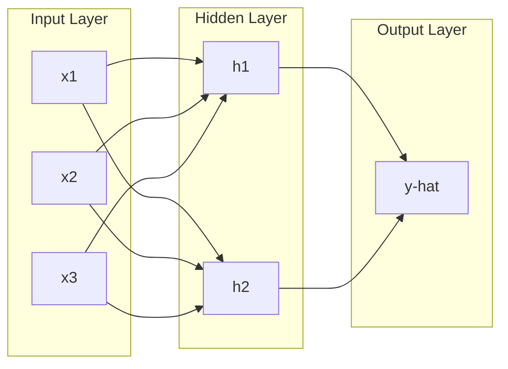
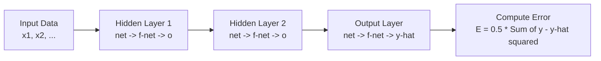
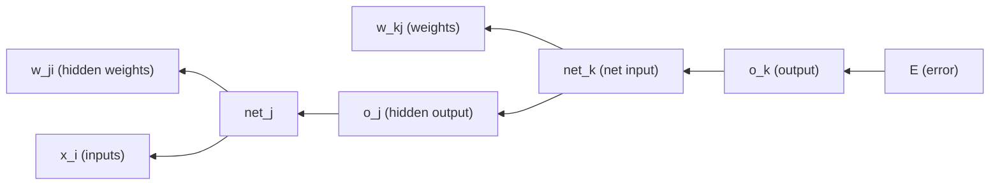
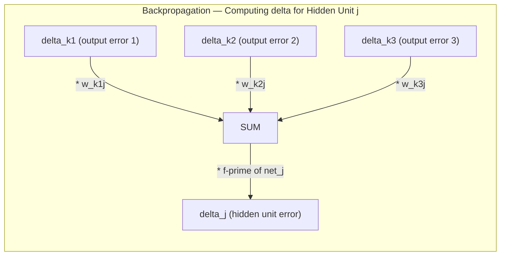
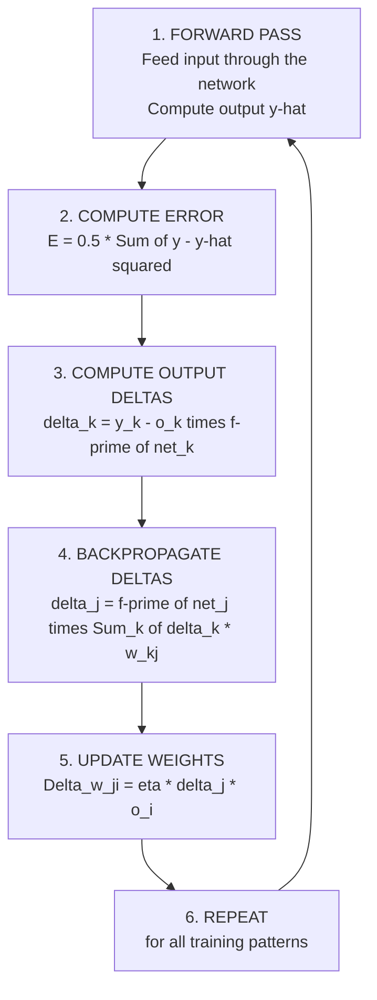
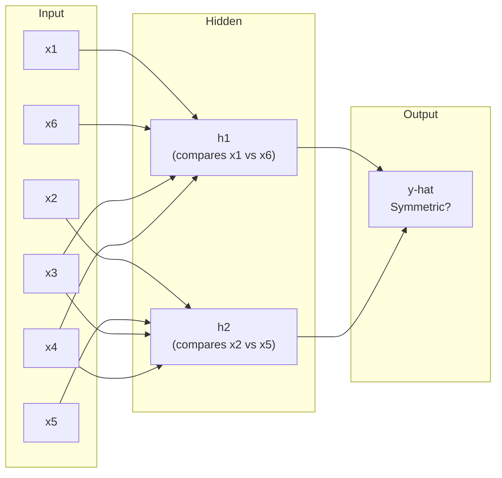
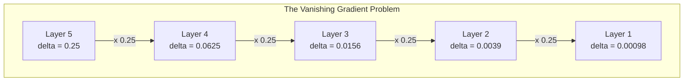
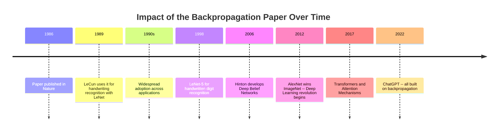

# 📜 Complete Breakdown: "Learning Representations by Back-propagating Errors" (1986)

> [!NOTE]
> **Authors:** David E. Rumelhart, Geoffrey E. Hinton, Ronald J. Williams
> **Journal:** Nature, Volume 323, Pages 533–536
> **Date:** October 9, 1986
> **DOI:** 10.1038/323533a0

---

## 📑 Table of Contents

1. [Historical Context — Why This Paper Exists](#-1-historical-context--why-this-paper-exists)
2. [The Core Problem — Credit Assignment](#-2-the-core-problem--credit-assignment)
3. [Neural Network Architecture](#-3-neural-network-architecture)
4. [The Forward Pass](#-4-the-forward-pass)
5. [The Error Function](#-5-the-error-function)
6. [The Chain Rule](#-6-the-chain-rule)
7. [The Backward Pass — Backpropagation](#-7-the-backward-pass--backpropagation)
8. [The Weight Update Rule — Generalized Delta Rule](#-8-the-weight-update-rule--generalized-delta-rule)
9. [The Sigmoid Activation Function](#-9-the-sigmoid-activation-function)
10. [Internal Representations](#-10-internal-representations)
11. [The Paper's Examples — XOR, Symmetry, Family Trees](#-11-the-papers-examples)
12. [Limitations and Observations](#-12-limitations-and-observations)
13. [Impact and Legacy](#-13-impact-and-legacy)

---

## 🏛 1. Historical Context — Why This Paper Exists

### 1.1 The Perceptron (1958)

In 1958, **Frank Rosenblatt** invented the **Perceptron** — the simplest possible artificial neural network. A perceptron is a **single unit** that takes inputs, multiplies them by weights, sums everything up, and produces a single output.

```
Inputs            Weights          Sum            Decision
x1 ──────── w1 ──┐
                   ├──> Sum(wi*xi) ──> >= threshold? -> 1 (yes)
x2 ──────── w2 ──┘                    <  threshold? -> 0 (no)
```

**The Problem:** The perceptron can only learn problems that are **linearly separable** — problems where you can draw a straight line to separate the two classes. It can learn AND and OR, but **NOT** XOR.

### 1.2 Minsky & Papert's Book — 1969

In 1969, **Marvin Minsky** and **Seymour Papert** published a book called **"Perceptrons"** where they mathematically proved that single-layer perceptrons **cannot** solve many important problems, such as XOR.

> **XOR (Exclusive OR):** Given two binary inputs, the output is 1 if the inputs are *different*, and 0 if they are the *same*.

| x1 | x2 | XOR |
|----|----|-----|
| 0  | 0  | 0   |
| 0  | 1  | 1   |
| 1  | 0  | 1   |
| 1  | 1  | 0   |

Minsky and Papert acknowledged that adding **hidden layers** could solve such problems, but stated: *"there is no known effective method for training them."*

This triggered the **AI Winter** — a period of roughly 15 years where funding dried up and interest in neural networks collapsed.

### 1.3 The 1986 Paper Arrives

Rumelhart, Hinton & Williams' paper came to solve **exactly this problem** — how to train hidden layers in a multi-layer network.

> [!IMPORTANT]
> This paper did not *invent* backpropagation (earlier work by Werbos in 1974 and Parker in 1985 existed), but it was the paper that **presented it clearly, proved it works on real problems**, and revived the entire field of neural networks.

---

## 🎯 2. The Core Problem — Credit Assignment

### 2.1 What Exactly Is the Problem?

Imagine a neural network with 3 layers:



- **Output layer:** We know the correct answer (target), so we can compute the error directly.
- **Hidden layer:** We have **no idea** what the correct answer should be for h1 or h2! There is no target.

> **The Central Question:** If the network produces a wrong answer, **who is responsible?** The weights between the inputs and the hidden layer? Or the weights between the hidden layer and the output? And **by how much** is each weight responsible?

This is the **Credit Assignment Problem** — how to assign "blame" or "credit" to every weight in the network.

### 2.2 The Paper's Solution

The paper says: **Use calculus!** Specifically, use the **Chain Rule** to compute the effect of every single weight on the final error, even if that weight is in a hidden layer far from the output.

---

## 🧱 3. Neural Network Architecture

### 3.1 Key Terminology

The paper describes a **feedforward neural network**. Here is every term explained:

| Term | Definition |
|------|-----------|
| **Unit** | A single computational element in the network (analogous to a neuron in the brain) |
| **Layer** | A group of units at the same level |
| **Input unit** | Receives raw data from the outside world |
| **Hidden unit** | An intermediate unit not visible from outside the network |
| **Output unit** | Produces the final result |
| **Weight (wji)** | The strength of the connection from unit i to unit j |
| **Bias (bj)** | A constant value added to the weighted sum; allows the unit to activate even with all-zero inputs |
| **Connection** | A directed link between two units |
| **Feedforward** | Information flows in one direction only — from input to output, never backward |
| **Activation** | The output value a unit produces after processing its inputs |
| **Net input** | The weighted sum of all inputs to a unit before applying the activation function |

### 3.2 How a Single Unit Works

Every unit j in the network performs two operations:

**Operation 1 — Compute the net input:**

$$net_j = \sum_{i} w_{ji} \cdot o_i + b_j$$

| Symbol | Meaning |
|--------|---------|
| $net_j$ | The net input to unit j — the weighted sum of all incoming signals |
| $w_{ji}$ | The weight from unit i to unit j |
| $o_i$ | The output of unit i (the unit feeding into j) |
| $b_j$ | The bias of unit j — a constant that shifts the activation threshold |
| $\sum$ | Summation — we sum over all units i connected to unit j |

**Operation 2 — Apply the activation function:**

$$o_j = f(net_j)$$

We pass the net input through a **non-linear function** to get the unit's output.

> [!TIP]
> **Why do we need a non-linear function?**
> Without non-linearity, the entire network (regardless of how many layers it has) collapses to a single linear transformation. The composition of linear functions is just another linear function. Non-linearity gives the network the power to learn complex, non-linear patterns.

### 3.3 Diagram of a Single Unit

```
        o1 ──w_j1──┐
                    |
        o2 ──w_j2──|
                    +──> [SUM] ──> net_j ──> [f(.)] ──> o_j
        o3 ──w_j3──|
                    |
        1  ──b_j───┘
       (bias)
```

### 3.4 Numerical Example

Suppose unit j receives inputs from 3 units:
- o1 = 0.5, w_j1 = 0.4
- o2 = 0.8, w_j2 = -0.3
- o3 = 1.0, w_j3 = 0.2
- b_j = 0.1

```
net_j = (0.5 * 0.4) + (0.8 * -0.3) + (1.0 * 0.2) + 0.1
      = 0.20 + (-0.24) + 0.20 + 0.10
      = 0.26

o_j = f(0.26)          <-- Apply the sigmoid function (explained in detail later)
    = 1 / (1 + e^(-0.26))
    = 1 / (1 + 0.771)
    = 1 / 1.771
    = 0.5646
```

---

## ➡️ 4. The Forward Pass

### 4.1 What Is the Forward Pass?

This is the first step of learning. We feed data through the network from input to output, computing each unit's activation along the way.



### 4.2 Forward Pass Step by Step

**Step 1 — Clamp the inputs:**

Each input unit simply takes one value from the data.

```
o_input1 = x1    (first input value)
o_input2 = x2    (second input value)
...
```

**Step 2 — Compute the hidden layer:**

For each unit j in the hidden layer:

```
net_j = SUM_i( w_ji * o_i ) + b_j     <-- weighted sum
o_j   = f(net_j)                       <-- apply activation function
```

**Step 3 — Compute the output layer:**

Same exact computation, but the inputs are now the hidden layer outputs.

**Step 4 — Compute the error:**

Compare the actual outputs to the desired targets.

### 4.3 Complete Numerical Example

Consider a simple network for the AND function:

```
Input layer:  x1, x2
Hidden layer: h1 (one unit)
Output layer: y-hat (one unit)
```

**Initial weights (random):**
- w_h1_x1 = 0.5,   w_h1_x2 = 0.5,   b_h1 = -0.7
- w_yhat_h1 = 0.8,  b_yhat = -0.3

**Input:** x1 = 1, x2 = 1 (Target: AND(1,1) = 1)

```
Step 1: net_h1 = (1 * 0.5) + (1 * 0.5) + (-0.7) = 0.3
Step 2: o_h1   = sigmoid(0.3) = 1/(1 + e^(-0.3)) = 0.5744

Step 3: net_yhat = (0.5744 * 0.8) + (-0.3) = 0.1595
Step 4: y_hat    = sigmoid(0.1595) = 1/(1 + e^(-0.1595)) = 0.5398

Error: target = 1.0, actual = 0.5398 <-- There is error! We need to learn.
```

---

## 📉 5. The Error Function

### 5.1 Definition

The paper uses the **Sum of Squared Errors (SSE)**:

$$E = \frac{1}{2} \sum_{p} \sum_{k} (y_{pk} - o_{pk})^2$$

| Symbol | Meaning |
|--------|---------|
| $E$ | Total error — the number we want to minimize |
| $p$ | Training pattern index. If we have 100 training examples, p goes from 1 to 100 |
| $k$ | Output unit index. If we have 3 outputs, k goes from 1 to 3 |
| $y_{pk}$ | The desired (target) value for output unit k on pattern p |
| $o_{pk}$ | The actual output value for output unit k on pattern p |
| $\frac{1}{2}$ | A convenience factor — when we differentiate $x^2$, the 2 cancels with the $\frac{1}{2}$ |

### 5.2 Why Squared Errors?

| Reason | Explanation |
|--------|-------------|
| **Always positive** | Positive and negative errors don't cancel each other out |
| **Penalizes large errors more** | Error of 2 becomes 4, error of 5 becomes 25 |
| **Simple derivative** | $\frac{d}{dx}(x^2) = 2x$ — clean and easy |
| **Smooth surface** | No sharp edges — the function is differentiable everywhere |

### 5.3 Numerical Example

Suppose we have a network with 2 outputs and 1 training pattern:

```
Target:  y1 = 1.0,   y2 = 0.0
Actual:  o1 = 0.7,   o2 = 0.3

E = 0.5 * [(1.0 - 0.7)^2 + (0.0 - 0.3)^2]
  = 0.5 * [(0.3)^2 + (-0.3)^2]
  = 0.5 * [0.09 + 0.09]
  = 0.5 * 0.18
  = 0.09
```

### 5.4 The Error Surface

> [!IMPORTANT]
> **Key concept:** Think of the error function E as a **mountainous landscape** in a high-dimensional space. Each dimension is one weight. **Our goal** is to descend from the mountain peak to the valley (lowest error point).

```
     Error E
      ^
      |    /\
      |   /  \         /\
      |  /    \       /  \
      | /      \     /    \
      |/        \   /      \
      |          \ /        \
      |           *          \         <-- Global Minimum
      |     Local  \          \              (the best solution)
      |     Min     \
      +----------------------------> Weights w
```

**Gradient Descent:** We compute the slope of the surface at our current position and move in the direction that decreases the error.

---

## ⛓ 6. The Chain Rule

### 6.1 What Is the Chain Rule?

The Chain Rule is a tool from **calculus** that allows us to compute the derivative of a **composite function** — a function made up of nested functions.

**Simple form:**

If $y = f(g(x))$, then:

$$\frac{dy}{dx} = \frac{dy}{dg} \cdot \frac{dg}{dx}$$

**Simple example:**

If $y = (3x + 2)^2$:
- Let $g = 3x + 2$
- Then $y = g^2$

```
dy/dx = dy/dg * dg/dx
      = 2g * 3
      = 2(3x + 2) * 3
      = 6(3x + 2)
```

### 6.2 Why Do We Need the Chain Rule for Neural Networks?

Because the error E is a **deeply nested composite function**:

```
E  <-- is a function of --> outputs (o_k)
                             <-- which are functions of --> net inputs (net_k)
                                                            <-- which are functions of --> weights (w) and previous layer outputs
                                                                                           <-- which are functions of --> earlier net inputs
                                                                                                                          <-- which are functions of --> earlier weights and inputs
```



### 6.3 Applying the Chain Rule in the Paper

To compute the effect of any weight on the error:

**For a weight in the output layer** ($w_{kj}$):

$$\frac{\partial E}{\partial w_{kj}} = \frac{\partial E}{\partial o_k} \cdot \frac{\partial o_k}{\partial net_k} \cdot \frac{\partial net_k}{\partial w_{kj}}$$

Breaking down each piece:

| Piece | What it measures | How to compute |
|-------|-----------------|----------------|
| $\frac{\partial E}{\partial o_k}$ | How much does the error change when output $o_k$ changes? | $= -(y_k - o_k)$ |
| $\frac{\partial o_k}{\partial net_k}$ | How much does the output change when net input changes? | $= f'(net_k)$ |
| $\frac{\partial net_k}{\partial w_{kj}}$ | How much does the net input change when weight $w_{kj}$ changes? | $= o_j$ |

**For a weight in a hidden layer** ($w_{ji}$):

$$\frac{\partial E}{\partial w_{ji}} = \frac{\partial E}{\partial o_j} \cdot \frac{\partial o_j}{\partial net_j} \cdot \frac{\partial net_j}{\partial w_{ji}}$$

The challenge here: how do we compute $\frac{\partial E}{\partial o_j}$? Hidden unit j affects **every** output unit! So we must sum its effect on all of them:

$$\frac{\partial E}{\partial o_j} = \sum_k \frac{\partial E}{\partial net_k} \cdot \frac{\partial net_k}{\partial o_j} = \sum_k \delta_k \cdot w_{kj}$$

> [!TIP]
> **This is the secret of backpropagation:** We compute the output errors first, then **propagate them backward** through the weights to determine the error of each hidden unit.

---

## ⬅️ 7. The Backward Pass — Backpropagation

### 7.1 Defining the Error Signal $\delta$ (delta)

The paper defines a crucial quantity called **delta** — the error signal for each unit:

$$\delta_j = -\frac{\partial E}{\partial net_j}$$

Delta measures: **"If we change the net input to unit j by a tiny amount, how much does the total error change?"**

### 7.2 Computing $\delta$ for an Output Unit

For unit k in the output layer:

$$\delta_k = (y_k - o_k) \cdot f'(net_k)$$

**Breaking down the equation:**

| Part | Meaning |
|------|---------|
| $(y_k - o_k)$ | The difference between target and actual output — the **raw error** |
| $f'(net_k)$ | The derivative of the activation function — the **unit's sensitivity** (if the unit is in a saturated region, the derivative is small and the update will be slow) |

**Derivation step by step:**

```
dE/dnet_k = dE/do_k * do_k/dnet_k

Where:
  dE/do_k = d[0.5 * (y_k - o_k)^2] / do_k = -(y_k - o_k)

  do_k/dnet_k = f'(net_k)

Therefore:
  delta_k = -dE/dnet_k = (y_k - o_k) * f'(net_k)  ✓
```

### 7.3 Computing $\delta$ for a Hidden Unit — ★ THE KEY INNOVATION ★

For unit j in a hidden layer:

$$\delta_j = f'(net_j) \cdot \sum_k \delta_k \cdot w_{kj}$$

**Breaking down the equation:**

| Part | Meaning |
|------|---------|
| $\sum_k (\delta_k \cdot w_{kj})$ | The **weighted sum of errors from all units that j feeds into**. This means "blame" is propagated backward in proportion to the connection strength |
| $f'(net_j)$ | The derivative of the activation function at unit j — determines how "sensitive" the unit is to change |



### 7.4 Full Derivation of Hidden Unit $\delta$

```
dE/dnet_j = dE/do_j * do_j/dnet_j

Where:
  do_j/dnet_j = f'(net_j)      <-- derivative of activation function

  dE/do_j = ?    <-- HERE IS THE PROBLEM! There is no direct target for o_j

Solution: o_j affects E indirectly through every output unit k:

  dE/do_j = SUM_k( dE/dnet_k * dnet_k/do_j )

Where:
  dnet_k/do_j = d(SUM_j w_kj * o_j) / do_j = w_kj

  dE/dnet_k = -delta_k

Therefore:
  dE/do_j = -SUM_k( delta_k * w_kj )

  dE/dnet_j = -SUM_k( delta_k * w_kj ) * f'(net_j)

  delta_j = -dE/dnet_j = f'(net_j) * SUM_k( delta_k * w_kj )  ✓
```

### 7.5 The Complete Algorithm Summary



---

## 📐 8. The Weight Update Rule — Generalized Delta Rule

### 8.1 The Core Equation

$$\Delta w_{ji} = \eta \cdot \delta_j \cdot o_i$$

| Symbol | Name | Meaning |
|--------|------|---------|
| $\Delta w_{ji}$ | Weight change | The amount to add to the current weight |
| $\eta$ (eta) | Learning rate | A small number (e.g., 0.01 or 0.1) controlling the step size |
| $\delta_j$ | Delta of unit j | The error signal we computed |
| $o_i$ | Output of unit i | The signal coming from the source unit |

**Weight update:**

$$w_{ji}^{new} = w_{ji}^{old} + \Delta w_{ji}$$

### 8.2 Intuition — Why Does This Equation Make Sense?

```
Delta_w_ji = eta * delta_j * o_i
              |       |        |
              |       |        +-- If input o_i is large, this weight is
              |       |            influential --> needs bigger adjustment
              |       |
              |       +-- If error delta_j is large, the unit needs
              |           more correction --> bigger adjustment
              |
              +-- Controls learning speed -- too large and we
                  overshoot; too small and learning is too slow
```

### 8.3 The Learning Rate $\eta$ — In Detail

```
eta very small (0.001):
  * Learning is very slow
  * But precise
  * May get stuck in local minima

eta too large (1.0):
  * Learning is fast
  * But may oscillate wildly
  * May fail to converge at all

eta just right (0.01 - 0.1):
  * Balance between speed and precision
  * Optimal value found by experimentation
```

```
   E (Error)
   ^
   |  \                   Large eta: Jumps over the valley   X--X--X--X
   |   \                                                      /    \
   |    \               Good eta: Smooth descent   *--*--*--*
   |     \                                               \/
   |      \           Small eta: Very slow descent  .....  *
   |       \/
   +--------------------------------------------> w
```

### 8.4 Learning Mode: Online vs Batch

The paper mentions two modes for applying weight updates:

**Pattern-by-Pattern (Online/Stochastic):**
- Compute the error for each training pattern and update weights immediately
- $\Delta w_{ji} = \eta \cdot \delta_{pj} \cdot o_{pi}$ (for pattern p)
- Pros: Faster per-step, adds noise that can escape local minima
- Cons: Noisy gradient, not the true gradient

**Batch Mode:**
- Accumulate errors over all training patterns, then update once
- $\Delta w_{ji} = \eta \cdot \sum_p \delta_{pj} \cdot o_{pi}$
- Pros: True gradient direction, smoother convergence
- Cons: Slower, requires more memory

> [!NOTE]
> The paper prefers batch mode because it follows the true gradient of the total error. However, in modern practice, **mini-batch SGD** (a hybrid) is the standard approach.

### 8.5 The Momentum Term

The paper also introduces a **momentum** term:

$$\Delta w_{ji}(t+1) = \eta \cdot \delta_j \cdot o_i + \alpha \cdot \Delta w_{ji}(t)$$

| Symbol | Meaning |
|--------|---------|
| $\alpha$ (alpha) | Momentum coefficient (typically 0.9) |
| $\Delta w_{ji}(t)$ | The previous weight change at time step t |

**The idea:** Add a fraction of the previous update to the current update. This does 3 things:

1. **Accelerates learning** when the gradient is consistently pointing in the same direction (like a ball rolling downhill gaining speed)
2. **Dampens oscillation** when the gradient rapidly changes direction
3. **Helps escape local minima** by carrying momentum through small bumps

```
Without Momentum:           With Momentum:
  /\/\/\/\/\                  /------\
 /          \                /        \
/            \  <--slow     /          \  <--fast and smooth
```

---

## 📊 9. The Sigmoid Activation Function

### 9.1 Definition

$$f(x) = \sigma(x) = \frac{1}{1 + e^{-x}}$$

| Symbol | Meaning |
|--------|---------|
| $\sigma$ | Symbol for the sigmoid function |
| $e$ | Euler's number, approximately 2.71828 |
| $x$ | The net input ($net_j$) |

### 9.2 Properties of the Sigmoid

```
   sigma(x)
   1.0 |                          .--------
       |                        /
       |                      /
   0.5 | . . . . . . . . . .X. . . . . . . .    <-- sigma(0) = 0.5
       |                  /
       |                /
   0.0 |---------------'
       +---+---+---+---+---+---+---+---+---+--> x
          -4  -3  -2  -1   0   1   2   3   4
```

**Key Properties:**

| Property | Explanation |
|----------|-------------|
| **Range: (0, 1)** | Output is always between 0 and 1 (never reaches them exactly) |
| **$\sigma(0) = 0.5$** | At zero input, the output is exactly 0.5 |
| **Monotonically increasing** | As x increases, $\sigma(x)$ always increases |
| **Saturation** | For very large x, $\sigma \to 1$. For very negative x, $\sigma \to 0$. In both regions, the derivative is nearly 0 |
| **Smooth and continuous** | No sharp edges — differentiable at every point |

### 9.3 Sample Values

| x | $\sigma(x)$ |
|---|----------|
| -10 | 0.0000 |
| -5 | 0.0067 |
| -3 | 0.0474 |
| -2 | 0.1192 |
| -1 | 0.2689 |
| 0 | 0.5000 |
| 1 | 0.7311 |
| 2 | 0.8808 |
| 3 | 0.9526 |
| 5 | 0.9933 |
| 10 | 1.0000 |

### 9.4 The Derivative — ★ THE MAGIC PROPERTY ★

$$f'(x) = f(x) \cdot (1 - f(x)) = \sigma(x) \cdot (1 - \sigma(x))$$

**This means:** The derivative can be computed from **the function value itself!** No extra computation needed.

### 9.5 Full Proof of the Derivative

```
f(x) = (1 + e^(-x))^(-1)

Step 1: Apply the chain rule for (...)^(-1)

  f'(x) = -1 * (1 + e^(-x))^(-2) * d/dx[1 + e^(-x)]
         = -1 * (1 + e^(-x))^(-2) * (-e^(-x))
         = e^(-x) / (1 + e^(-x))^2

Step 2: Rewrite as a product

  f'(x) = [1 / (1 + e^(-x))] * [e^(-x) / (1 + e^(-x))]
         = f(x) * [e^(-x) / (1 + e^(-x))]

Step 3: Show that the second factor equals (1 - f(x))

  1 - f(x) = 1 - 1/(1 + e^(-x))
            = (1 + e^(-x) - 1) / (1 + e^(-x))
            = e^(-x) / (1 + e^(-x))

Step 4: Substitute

  f'(x) = f(x) * (1 - f(x))  ✓   Q.E.D.
```

### 9.6 Graph of the Derivative

```
   f'(x)
  0.25 |            .X.              <-- Peak at x=0 where f'(0) = 0.25
       |          /    \
  0.20 |        /        \
       |      /            \
  0.15 |    /                \
       |  /                    \
  0.10 |/                        \
       |                            \
  0.05 |                              \
       |                                \
  0.00 |--                                --
       +---+---+---+---+---+---+---+---+---> x
          -4  -3  -2  -1   0   1   2   3
```

> [!WARNING]
> **The Vanishing Gradient Problem:**
> Notice that the maximum value of the derivative is only **0.25**, and it approaches zero quickly. This means that in networks with many layers, the gradients **multiply together and become vanishingly small** — the early layers learn extremely slowly. This problem was discovered later and solved with alternative activation functions like **ReLU**.

### 9.7 Why Did the Paper Choose the Sigmoid?

| Reason | Explanation |
|--------|-------------|
| **Differentiable** | Essential requirement for backpropagation |
| **Simple derivative** | Computed from the function value itself (no extra cost) |
| **Bounded output** | Between 0 and 1 — can be interpreted as a probability |
| **Non-linear** | Gives the network the power to learn complex relationships |

---

## 🧠 10. Internal Representations

### 10.1 The Core Insight

> [!IMPORTANT]
> **This is the paper's most important discovery:** Not just that backpropagation works — but that the hidden layers **learn by themselves** useful representations of the data!

**What is an "internal representation"?**

Imagine you want to classify animals. The hidden layer might learn **intermediate concepts** like:
- "Does this animal have feathers?" → hidden unit 1
- "Does it live in water?" → hidden unit 2
- "Does it have 4 legs?" → hidden unit 3

**Nobody told the network** to learn these concepts! It discovered them on its own because they are useful for reducing the error.

### 10.2 The Difference Between Raw Inputs and Representations

```
Raw inputs (e.g., pixels):
[0.2, 0.8, 0.1, 0.9, 0.3, 0.7, ...]  <-- Numbers with no obvious meaning

           | Hidden Layer |

Internal representation:
[0.95, 0.02, 0.87]  <-- "feathers=yes, aquatic=no, 4-legs=yes"
                         ^^ Automatically discovered meanings!
```

### 10.3 Why This Matters

Before this paper, people thought you had to **manually design** the features for a learning system (this was called "feature engineering"). The paper showed that a network can **discover its own features** — the hidden layers automatically create useful intermediate representations.

This is the foundation of what we now call **representation learning** and **deep learning**.

---

## 🧪 11. The Paper's Examples

### 11.1 Example 1: The XOR Problem

**The Problem:** Learn the XOR function, which cannot be solved by a single-layer network.

| x1 | x2 | XOR |
|----|----|-----|
| 0  | 0  | 0   |
| 0  | 1  | 1   |
| 1  | 0  | 1   |
| 1  | 1  | 0   |

**Network Architecture:**

```
  x1 --+--> h1 --+--> y-hat
       X         |
  x2 --+--> (h2)-+
```

Input (2 units) + Hidden (1 or 2 units) + Output (1 unit)

**Why a single layer fails:**

```
  x2
  1 | *(0,1)=1        o(1,1)=0
    |
    |
  0 | o(0,0)=0        *(1,0)=1
    +-----------------------> x1
    0                  1

  No single straight line can separate the * from the o!
```

**What the hidden layer learns:**

The hidden unit(s) learn to **transform the input space** into a new space where the classes become linearly separable:

```
  Original Space:               Transformed Space (after hidden layer):

  x2                            h2
  1 | *       o                 1 |     *(0,1)   *(1,0)
    |                             |     /
    |                             |   / <-- separating line!
  0 | o       *                 0 | *(0,0)
    +-----------> x1              +-----------------> h1
    0         1                   0      *(1,1)
```

> The hidden layer **warps space** so that points that were impossible to separate with a straight line can now be separated!

### 11.2 Example 2: Symmetry Detection

**The Problem:** Given a binary array, determine whether it is symmetrical about its center point.

```
Symmetric:      [1, 0, 1, 1, 0, 1]  -> 1 (yes)
Not symmetric:  [1, 0, 0, 1, 0, 1]  -> 0 (no)
```

**Why a hidden layer is needed:**

Each individual input unit has no information about global symmetry. Unit x1 needs to be compared with unit x6, unit x2 with x5, etc. This comparison requires **combining information** from distant inputs — something only a hidden layer can do.

**The Solution:** The paper presents a network with **2 hidden units** that learn to compare opposite-end pairs:



### 11.3 Example 3: Family Trees — ★ The Most Famous Example ★

**The Problem:** Two isomorphic family trees (English and Italian) with identical structures. The network must learn family relationships.

**The Data:** Triples of the form (person1, relationship, person2), such as:
- (Colin, has-father, James)
- (Colin, has-mother, Victoria)
- (James, has-wife, Victoria)

```
English Family Tree:                   Italian Family Tree:

  Christopher = Penelope                Roberto = Maria
       |                                     |
  +----+----+                           +----+----+
  |         |                           |         |
Arthur = Margaret                    Pierro = Francesca
  |         Andrew = Christine         |        Emilio = Lucia
  |                   |                |                  |
Colin  Charlotte    James            Alfonso  Sophia   Marco
```

**Network Architecture:**

```
Input Layer:  person1 (24 units, one-hot) + relationship (12 units, one-hot)
       |
Hidden Layer 1: 6 units  <-- THIS IS WHERE REPRESENTATIONS FORM!
       |
Hidden Layer 2: 12 units
       |
Output Layer: person2 (24 units)
```

**The Amazing Discovery:**

After training, the 6 hidden units in layer 1 learned **meaningful concepts** on their own:

| Hidden Unit | Learned Concept |
|-------------|----------------|
| h1 | Nationality (English vs Italian) |
| h2 | Generation (1st vs 2nd vs 3rd) |
| h3 | Branch of the family (left vs right) |
| h4 | Gender (male vs female) |

> [!CAUTION]
> **The crucial point:** Nobody told the network that concepts like "nationality", "generation", or "gender" exist! It **discovered** them on its own because they are useful for reducing the prediction error. This is the power of "learning representations"!

---

## ⚠️ 12. Limitations and Observations

### 12.1 Limitations Mentioned in the Paper

| Limitation | Explanation |
|-----------|-------------|
| **Slow convergence** | The algorithm needs many iterations to reach a good solution |
| **Local minima** | The algorithm may get stuck at a point that is not the globally best solution |
| **Architecture selection** | The number of layers and units must be chosen manually — no automatic method exists |
| **Learning rate sensitivity** | Must be chosen carefully — too large or too small both cause problems |

### 12.2 Limitations Discovered Later

| Limitation | Explanation |
|-----------|-------------|
| **Vanishing Gradients** | In deep networks, gradients shrink exponentially as they propagate backward |
| **Saturating Activations** | The sigmoid saturates (derivative $\to 0$) for large and small inputs |
| **Slow Training** | SGD with momentum is not enough — need better optimizers like Adam |



> Layer 1 learns **256 times slower** than layer 5!

---

## 🌍 13. Impact and Legacy

### 13.1 Timeline of Impact



### 13.2 Mapping 1986 Concepts to Modern Equivalents

| Concept in the Paper (1986) | Modern Equivalent (2024) |
|-----------------------------|--------------------------|
| Sigmoid activation | ReLU, GELU, Swish |
| Sum of squared errors | Cross-entropy loss |
| SGD + Momentum | Adam, AdamW, LAMB |
| Manual architecture | Neural Architecture Search (NAS) |
| Feedforward networks | Transformers, ResNets, U-Nets |
| Internal representations | Embeddings, Latent spaces |
| Backpropagation | **Still the same!** Every modern model trains with backprop |

> [!IMPORTANT]
> **The Most Important Point:** Despite all the advances, **the backpropagation algorithm itself** is still the foundation on which all neural network training is built in 2024. GPT-4, Gemini, Claude — they all train using the same core idea from this 1986 paper!

### 13.3 The Authors

| Scientist | Later Achievement |
|-----------|------------------|
| **Geoffrey Hinton** | Nobel Prize in Physics 2024 for "foundational discoveries enabling machine learning with artificial neural networks" |
| **David Rumelhart** | Founded the connectionism movement and deeply influenced cognitive psychology. Passed away in 2011 |
| **Ronald Williams** | Developed the REINFORCE algorithm for Reinforcement Learning |

---

## 📝 Complete Equation Reference

All six core equations in one place:

```
+-------------------------------------------------------------------+
|                                                                     |
|  1. Net Input:           net_j = SUM_i( w_ji * o_i ) + b_j         |
|                                                                     |
|  2. Activation:          o_j = sigma(net_j) = 1 / (1 + e^(-net_j)) |
|                                                                     |
|  3. Activation           sigma'(x) = sigma(x) * (1 - sigma(x))     |
|     Derivative:                                                     |
|                                                                     |
|  4. Error Function:      E = 0.5 * SUM_p SUM_k (y_pk - o_pk)^2     |
|                                                                     |
|  5a. Output delta:       delta_k = (y_k - o_k) * sigma'(net_k)     |
|  5b. Hidden delta:       delta_j = sigma'(net_j) * SUM_k(delta_k * |
|                                    w_kj)                            |
|                                                                     |
|  6. Weight Update:       Delta_w_ji = eta * delta_j * o_i           |
|                          w_ji(new) = w_ji(old) + Delta_w_ji         |
|                                                                     |
|  (+ momentum):           Delta_w_ji(t+1) = eta * delta_j * o_i     |
|                                           + alpha * Delta_w_ji(t)   |
|                                                                     |
+-------------------------------------------------------------------+
```

---

> [!NOTE]
> **Sources:**
> - Rumelhart, D.E., Hinton, G.E. & Williams, R.J. Learning representations by back-propagating errors. *Nature* 323, 533–536 (1986). DOI: 10.1038/323533a0
> - The longer version: Rumelhart, D.E., Hinton, G.E. & Williams, R.J. (1986). Learning internal representations by error propagation. *Parallel Distributed Processing*, Vol. 1, Ch. 8.
