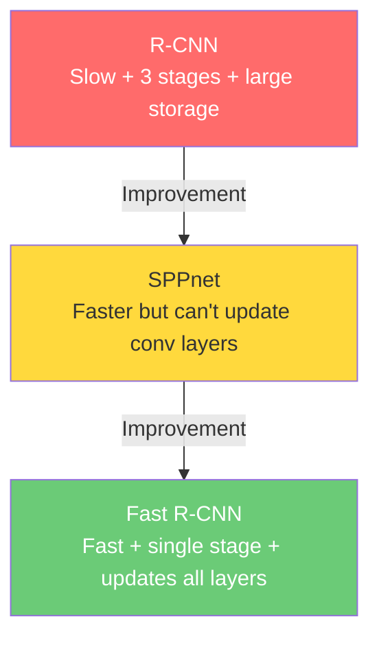

# 📄 Fast R-CNN — A Comprehensive Detailed Explanation

> **Paper:** Fast R-CNN  
> **Author:** Ross Girshick (Microsoft Research)  
> **Year:** 2015  
> **Goal:** Speed up and improve Object Detection using Deep Learning  

---

## 📑 Table of Contents

1. [Introduction: What is Object Detection?](#1-introduction-what-is-object-detection)
2. [Problems That Existed Before Fast R-CNN](#2-problems-that-existed-before-fast-r-cnn)
3. [R-CNN — The Original Grandfather](#3-r-cnn--the-original-grandfather)
4. [SPPnet — The First Attempt at Improvement](#4-sppnet--the-first-attempt-at-improvement)
5. [Fast R-CNN — The Comprehensive Solution](#5-fast-r-cnn--the-comprehensive-solution)
6. [RoI Pooling Layer — The Heart of the System](#6-roi-pooling-layer--the-heart-of-the-system)
7. [Initializing from Pre-trained Networks](#7-initializing-from-pre-trained-networks)
8. [Fine-tuning and Training](#8-fine-tuning-and-training)
9. [Multi-task Loss — The Joint Loss Function](#9-multi-task-loss--the-joint-loss-function)
10. [Mini-batch Sampling — Choosing Training Samples](#10-mini-batch-sampling--choosing-training-samples)
11. [Back-propagation through RoI Pooling](#11-back-propagation-through-roi-pooling)
12. [Scale Invariance — Handling Different Object Sizes](#12-scale-invariance--handling-different-object-sizes)
13. [Truncated SVD — Speeding Up Test Time](#13-truncated-svd--speeding-up-test-time)
14. [Experimental Results](#14-experimental-results)
15. [Design Evaluation](#15-design-evaluation)
16. [Conclusion and Final Comparison](#16-conclusion-and-final-comparison)

---

## 1. Introduction: What is Object Detection?

### Simple Definition

**Object Detection** = Take an image and say **what** is in it and **where**.

It's not just saying "this image has a cat" (that's called **Classification**). You also need to pinpoint its **exact location** in the image by drawing a rectangle (Bounding Box) around it.

### Practical Example

```
Imagine an image containing:
- A dog in the upper part of the image
- A cat in the center
- A car in the background

Classification says: "The image has a dog, cat, and car"
Detection says:      "dog at (x=50, y=20, width=100, height=80)
                      cat at (x=200, y=150, width=90, height=70)
                      car at (x=300, y=100, width=200, height=120)"
```

### Why is Object Detection Harder Than Classification?

| Classification | Object Detection |
|---|---|
| One answer: "What is this image?" | Multiple answers: "What's in the image and where?" |
| Single output | Multiple outputs (each object has a class + location) |
| Relatively simple | Needs to handle many candidate locations |

### What is a Bounding Box?

A Bounding Box is a rectangle that defines where an object is in the image. It's defined by 4 numbers:

```
(x, y, w, h)
│  │  │  └── height of the rectangle
│  │  └───── width of the rectangle
│  └──────── y-coordinate of the top-left corner
└─────────── x-coordinate of the top-left corner
```

---

## 2. Problems That Existed Before Fast R-CNN

Methods before Fast R-CNN (like R-CNN and SPPnet) had major problems:

### Problem 1: Training Was a Multi-stage Pipeline (Many Separate Steps)

```
Why is this a problem?

Imagine you want to cook a dish, but instead of cooking everything together:
- Step 1: Boil the rice separately and set it aside
- Step 2: Cook the meat separately and set it aside
- Step 3: Make the sauce separately and set it aside
- Step 4: Try to combine them all

The problem is each step doesn't benefit from the others!
If you cooked them together, the rice would absorb the flavors
of the meat and sauce, and it would taste better.
```

### Problem 2: Training Was Slow and Expensive

- Extracting features from each proposal in each image and saving them to disk
- This took **2.5 GPU-days** for just 5,000 images!
- Required **hundreds of Gigabytes** of storage

### Problem 3: Detection Time Was Extremely Slow

- VGG16 took **47 seconds** per image!
- Imagine having a surveillance camera and wanting to do real-time detection 😅

---

## 3. R-CNN — The Original Grandfather

### The Core Idea

R-CNN (Region-based Convolutional Neural Network) was the first successful method to use Deep Learning for Object Detection.

### How R-CNN Works (Step by Step)

```
Original Image
      │
      ▼
┌─────────────────────┐
│  Selective Search    │  ← Extracts ~2000 "proposals" (Region Proposals)
│  (traditional algo)  │     for locations that might contain objects
└─────────────────────┘
      │
      ▼ (2000 image patches)
┌─────────────────────┐
│  Resize each patch   │  ← Each patch must be 227×227 pixels
│  to a fixed size     │
└─────────────────────┘
      │
      ▼ (2000 fixed-size patches)
┌─────────────────────┐
│  CNN (e.g. AlexNet)  │  ← Pass each patch through the CNN individually!
│  to extract Features │     That's 2000 forward passes!
└─────────────────────┘
      │
      ▼ (2000 feature vectors)
┌─────────────────────┐
│  SVM Classifier      │  ← Classify each feature vector
│  (separate stage)    │     Is it a dog? cat? car? background?
└─────────────────────┘
      │
      ▼
┌─────────────────────┐
│  Bounding Box        │  ← Refine the box location precisely
│  Regressor           │     (a third separate stage)
│  (separate stage)    │
└─────────────────────┘
```

### What is Selective Search?

> **Selective Search** is a traditional algorithm (not Deep Learning) that looks at the image and proposes locations that might contain objects.
>
> The idea: It starts from the smallest segments (regions similar in color/texture) and gradually merges them into larger regions. Each stage of merging is recorded as a "proposal."
>
> **Example:** If you have an image with a cat on a couch:
> - It finds a region with similar colors (the cat's body) → proposal
> - It finds another region (the couch) → proposal
> - It finds both together → a third proposal
> - And so on... until it produces ~2000 proposals

### Problems with R-CNN

| Problem | Details |
|---|---|
| **Very slow** | 2000 forward passes through the CNN per image! |
| **Complex training** | 3 separate stages (CNN + SVM + BBox Regressor) |
| **Large storage** | Must save features to disk |
| **Not end-to-end** | Each stage trains independently, no joint optimization |

---

## 4. SPPnet — The First Attempt at Improvement

### The Clever Idea Behind SPPnet

Instead of passing each of the 2000 patches through the CNN separately, **pass the entire image through the CNN just once** and extract features from the resulting feature map.

### The Difference Between R-CNN and SPPnet

```
R-CNN:
Image → 2000 patches → Each patch runs through the CNN individually → 2000 feature vectors
                         ↑
                  This is the bottleneck! CNN runs 2000 times!

SPPnet:
Image → CNN runs ONCE → Single Feature Map
                              │
                   Extract features for the 2000 regions
                   directly from the feature map
                              │
                        2000 feature vectors
```

### What is Spatial Pyramid Pooling (SPP)?

The problem: Fully Connected (FC) layers need a fixed-size input, but the regions we crop from the feature map have varying sizes.

The solution: The **SPP Layer** performs pooling at multiple levels:

```
Region of any size (e.g., 13×13)
          │
          ▼
    ┌─────────────┐
    │ Level 1:    │  Divide region into 1×1 → 1 value
    │ 1×1 grid    │
    ├─────────────┤
    │ Level 2:    │  Divide region into 2×2 → 4 values
    │ 2×2 grid    │
    ├─────────────┤
    │ Level 3:    │  Divide region into 4×4 → 16 values
    │ 4×4 grid    │
    └─────────────┘
          │
          ▼
    Concatenate all = 1 + 4 + 16 = 21 values
    (Fixed size regardless of the original region size!)
```

### Problems with SPPnet

Despite being faster than R-CNN, it still had problems:

1. **Training is still multi-stage** (CNN + SVM + BBox Regressor)
2. **Cannot update the conv layers** below the SPP layer during training (this limits accuracy)
3. **Still saves features to disk**

> **Why can't SPPnet update the conv layers?**
>
> The root cause is that each training sample (RoI) came from a different image. When you back-propagate through the SPP layer, you need to compute gradients for the entire image (because the receptive field can span the whole image). This means the training input is very large (often the entire image), making it highly inefficient.
>
> **Analogy:** Imagine you're studying 128 topics, and each topic is from a different textbook. You'd have to open 128 textbooks! But if 64 topics are from one textbook and 64 from another, you only need to open 2 books!

---

## 5. Fast R-CNN — The Comprehensive Solution

### The Main Idea

Fast R-CNN solves **all** the previous problems in a single, elegant approach:

### Advantages of Fast R-CNN

| Advantage | Explanation |
|---|---|
| **Higher detection quality** | Higher mAP than R-CNN and SPPnet |
| **Single-stage training** | Multi-task loss instead of 3 separate stages |
| **Updates all network layers** | Can update all layers including conv layers |
| **No disk storage needed** | No need to cache features on disk |

### Overall Architecture

```
                    Full Image
                         │
                         ▼
              ┌──────────────────┐
              │   Conv layers    │
              │ (e.g., VGG16)   │  ← Entire image passes through ONCE
              │ + Max Pooling    │
              └──────────────────┘
                         │
                         ▼
                 Conv Feature Map    ← Feature map for the entire image
                    (14×14×512 for example)
                         │
          ┌──────────────┼──────────────┐
          │              │              │
     Region 1       Region 2       Region 3  ... (from Selective Search)
          │              │              │
          ▼              ▼              ▼
    ┌──────────┐  ┌──────────┐  ┌──────────┐
    │RoI Pool  │  │RoI Pool  │  │RoI Pool  │  ← Convert each region to fixed size
    │ (7×7)    │  │ (7×7)    │  │ (7×7)    │
    └──────────┘  └──────────┘  └──────────┘
          │              │              │
          ▼              ▼              ▼
    ┌──────────┐  ┌──────────┐  ┌──────────┐
    │ FC layers│  │ FC layers│  │ FC layers│  ← Fully Connected layers
    └──────────┘  └──────────┘  └──────────┘
        │   │        │   │        │   │
        ▼   ▼        ▼   ▼        ▼   ▼
      cls  bbox    cls  bbox    cls  bbox     ← Two branches: Classification + BBox
```

### The Key Difference

```
R-CNN:     CNN runs 2000 times  →  Very slow
SPPnet:    CNN runs 1 time      →  Faster, but can't update conv layers
Fast RCNN: CNN runs 1 time      →  Faster + updates everything + single-stage training
```

---

## 6. RoI Pooling Layer — The Heart of the System

### The Problem It Solves

Region Proposals come in different sizes (one region might be 5×7, another 12×3, another 20×20), but the Fully Connected layers need a fixed-size input.

### How Does It Work?

RoI Pooling takes any region of any size and converts it to a fixed size `H×W` (e.g., `7×7`).

**Simplified Practical Example:**

```
We have a region in the feature map of size 6×8
We want to convert it to 3×4 (H=3, W=4)

Steps:
1. Divide the height: 6 ÷ 3 = 2 (each sub-window has height 2)
2. Divide the width:  8 ÷ 4 = 2 (each sub-window has width 2)

Feature Map Region (6×8):
┌────┬────┬────┬────┬────┬────┬────┬────┐
│ 1  │ 3  │ 5  │ 2  │ 7  │ 4  │ 1  │ 3  │
│ 4  │ 6  │ 2  │ 8  │ 1  │ 5  │ 9  │ 2  │
├────┼────┼────┼────┼────┼────┼────┼────┤
│ 2  │ 9  │ 1  │ 3  │ 6  │ 2  │ 4  │ 7  │
│ 5  │ 3  │ 7  │ 4  │ 8  │ 1  │ 3  │ 6  │
├────┼────┼────┼────┼────┼────┼────┼────┤
│ 3  │ 1  │ 4  │ 6  │ 2  │ 9  │ 5  │ 1  │
│ 7  │ 8  │ 2  │ 5  │ 3  │ 4  │ 7  │ 8  │
└────┴────┴────┴────┴────┴────┴────┴────┘

After dividing into a 3×4 grid and applying Max Pooling to each cell:

Result (3×4):
┌────┬────┬────┬────┐
│ 6  │ 8  │ 7  │ 9  │   ← max from each 2×2 sub-window
├────┼────┼────┼────┤
│ 9  │ 7  │ 8  │ 7  │
├────┼────┼────┼────┤
│ 8  │ 6  │ 9  │ 8  │
└────┴────┴────┴────┘
```

### Difference Between RoI Pooling and SPP

```
SPP:  Uses multiple levels (1×1, 2×2, 4×4, ...) and concatenates them
RoI:  Uses only ONE level (e.g., 7×7) → simpler and faster
```

> **Important Note:** RoI Pooling is a special case of SPP with only a single pyramid level.

### Mathematical Definition

Each RoI is defined by a tuple:

```
(r, c, h, w)
│  │  │  └── width
│  │  └───── height
│  └──────── y-coordinate of the top-left corner (row)
└─────────── x-coordinate of the top-left corner (column)
```

The output is `H × W` (e.g., `7 × 7`):
- Each sub-window is approximately `⌊h/H⌋ × ⌊w/W⌋` in size
- Max Pooling is applied within each sub-window
- Pooling is applied independently to each feature map channel

---

## 7. Initializing from Pre-trained Networks

### The Idea

Instead of training from scratch, we use a network **pre-trained** on ImageNet (1 million images + 1000 categories) and adapt it for Object Detection.

### Networks Used in the Paper

| Name | Model | Conv Layers | Size |
|---|---|---|---|
| **S** (Small) | CaffeNet (≈AlexNet) | 5 | Small |
| **M** (Medium) | VGG_CNN_M_1024 | 5 | Medium |
| **L** (Large) | VGG16 | 13 | Large |

### The 3 Transformations Applied

```
Original Network (trained on ImageNet for Classification):

Input → [Conv layers] → [Last Max Pool] → [FC layers] → [Softmax 1000 classes]

                                ↓ Transformation ↓

Fast R-CNN Network (for Detection):

Input + RoIs → [Conv layers] → [RoI Pooling] → [FC layers] → ┌ Softmax (K+1 classes)
                                     ↑                        └ BBox Regressor (K×4)
                          Replaces Last Max Pool
```

**Transformation 1:** Replace the last Max Pooling layer with an **RoI Pooling Layer**
- Set `H` and `W` to be compatible with the first FC layer (e.g., `H=W=7` for VGG16)

**Transformation 2:** Replace the last FC layer + Softmax (1000 ImageNet classes) with:
- **Branch 1:** FC + Softmax for `K+1` categories (K object classes + 1 background)
- **Branch 2:** FC for Bounding Box Regression (4 numbers × K classes)

**Transformation 3:** Modify the inputs:
- Instead of a single image → **a list of images + a list of RoIs**

> **Why K+1 classes instead of just K?**
>
> Because we need an additional class called "background." If a region doesn't contain any object, the model should say "this is background."
>
> **Example:** If we have 20 object types (PASCAL VOC), we'll have 21 classes:
> - Class 0: background
> - Class 1: aeroplane
> - Class 2: bicycle
> - ...
> - Class 20: tvmonitor

---

## 8. Fine-tuning and Training

### The Problem in SPPnet

SPPnet couldn't update the conv layers below the SPP layer. Why?

```
Imagine you have a mini-batch of 128 RoIs:
- In SPPnet/R-CNN: each RoI comes from a different image
  → 128 different images → 128 full forward passes
  → back-propagation needs to compute gradients for 128 images
  → extremely slow!

- In Fast R-CNN: only 2 images, 64 RoIs from each image
  → only 2 forward passes
  → RoIs from the same image share computation
  → roughly 64× faster!
```

### Hierarchical Sampling

```
Old method (R-CNN/SPPnet):
─────────────────────────────────
Mini-batch = 128 RoIs
Each RoI from a different image → 128 images!
                              ↓
                    Very slow computations

New method (Fast R-CNN):
────────────────────────────────
Mini-batch = 128 RoIs
N = 2 images
R/N = 128/2 = 64 RoIs from each image
                              ↓
                    RoIs from the same image
                    share features
                              ↓
                    ~64× faster!
```

> **Important question:** Doesn't selecting RoIs from the same image create correlation that hurts training?
>
> Theoretically it could, since RoIs from the same image are "correlated" with each other. But in practice, the paper showed this isn't an issue and achieves good results with fewer SGD iterations than R-CNN.

---

## 9. Multi-task Loss — The Joint Loss Function

### The Idea

Instead of training the model in 3 stages (CNN → SVM → BBox Regressor), we train it all at once with a **single loss function** that combines both tasks:
1. **Classification:** Classifying the RoI (what is it?)
2. **Bounding Box Regression:** Refining the box location (where exactly is it?)

### The Mathematical Formula

```
L(p, u, tᵘ, v) = L_cls(p, u) + λ · [u ≥ 1] · L_loc(tᵘ, v)
```

Let's break down each part:

### Part 1: Classification Loss

```
L_cls(p, u) = -log(pᵤ)
```

> **Explanation:**
> - `p` = probability vector for all classes (output of softmax)
> - `u` = the true class label (ground truth)
> - `pᵤ` = the probability the model assigned to the correct class
>
> **Example:**
> - Suppose we have 3 classes: [background, cat, dog]
> - Ground truth is "cat" (u = 1)
> - The model outputs probabilities: p = [0.1, 0.7, 0.2]
> - Then L_cls = -log(0.7) = 0.357
>
> If the model is more confident:
> - p = [0.05, 0.9, 0.05]
> - L_cls = -log(0.9) = 0.105  (lower loss = better! ✅)
>
> If the model is wrong:
> - p = [0.1, 0.2, 0.7]
> - L_cls = -log(0.2) = 1.609  (high loss = bad! ❌)

### Part 2: Bounding Box Regression Loss

```
L_loc(tᵘ, v) = Σᵢ smooth_L1(tᵘᵢ - vᵢ)      (i ∈ {x, y, w, h})
```

where:

```
                 ┌ 0.5x²        if |x| < 1
smooth_L1(x) =  │
                 └ |x| - 0.5    otherwise
```

> **Why smooth L1 instead of plain L2?**
>
> ```
> Comparison between L1, L2, and smooth L1:
>
> If the difference (x) = 10:
>   L2:        10² = 100         ← Way too large! Can cause exploding gradients
>   L1:        |10| = 10
>   smooth_L1: |10| - 0.5 = 9.5  ← Behaves like L1 for large values
>
> If the difference (x) = 0.5:
>   L2:        0.5² = 0.25
>   L1:        |0.5| = 0.5       ← Gradient is constant (1 or -1), not smooth
>   smooth_L1: 0.5 × 0.5² = 0.125 ← Smooth like L2 for small values
>
> So smooth L1 = best of both worlds:
> - For large values: behaves like L1 (no exploding gradients)
> - For small values: behaves like L2 (smooth and differentiable)
> ```

### Explaining `[u ≥ 1]` (Iverson Bracket)

```
[u ≥ 1] = ┌ 1    if u ≥ 1 (i.e., this RoI is an object, not background)
           └ 0    if u = 0 (i.e., this RoI is background)
```

> **Why do we ignore L_loc for background RoIs?**
>
> Because background has no object in it, so there's no ground-truth bounding box to compare against!
> It doesn't make sense to say "refine the box location" when there's nothing in the box.

### What Does Bounding Box Regression Actually Do?

The model predicts 4 adjustments (offsets) to the original proposal:

```
tₓ = adjustment to center x (horizontal shift)
tᵧ = adjustment to center y (vertical shift)
tᵥ = adjustment to width (in log scale)
tₕ = adjustment to height (in log scale)

Example:
─────
Original proposal: center at (100, 150), width 80, height 60

Model predicts:
  tₓ = 0.1   → shift center slightly to the right
  tᵧ = -0.05 → shift center slightly upward
  tᵥ = 0.2   → increase width slightly (e^0.2 ≈ 1.22×)
  tₕ = -0.1  → decrease height slightly (e^-0.1 ≈ 0.9×)

Refined BBox:
  x_new = 100 + 0.1 × 80 = 108
  y_new = 150 + (-0.05) × 60 = 147
  w_new = 80 × e^0.2 ≈ 97.7
  h_new = 60 × e^(-0.1) ≈ 54.3
```

> **Why use log scale for width and height?**
>
> To ensure width and height are **always positive**. Since `e^x` is always positive regardless of `x`, using log-space transformations guarantees we never get negative dimensions, which would be physically meaningless!

### The λ (Lambda) Parameter

```
λ = 1 in all experiments
```

- `λ` controls the balance between the classification loss and the localization loss
- If `λ` is large: the model focuses more on improving box location
- If `λ` is small: the model focuses more on classification
- The paper found that `λ = 1` works well (both tasks have equal importance)

---

## 10. Mini-batch Sampling — Choosing Training Samples

### How Are RoIs Selected for Training?

```
For each mini-batch:
├── N = 2 images (randomly selected)
├── R = 128 RoIs (64 from each image)
│
├── 25% foreground (32 RoIs):
│   └── IoU with ground truth ≥ 0.5
│       (These are RoIs that actually contain objects)
│
└── 75% background (96 RoIs):
    └── 0.1 ≤ IoU with ground truth < 0.5
        (These are RoIs with background or partial objects)
```

### What is IoU (Intersection over Union)?

```
IoU = Area of Intersection ÷ Area of Union

Visual example:
┌─────────┐
│  Box A   │
│    ┌─────┼────┐
│    │/////│    │
└────┼─────┘    │
     │   Box B  │
     └──────────┘

The hatched region (/////) = Intersection
All area covered by any box = Union

IoU = Intersection / Union

Examples:
- IoU = 1.0  → Boxes are perfectly overlapping (perfect!)
- IoU = 0.5  → Medium overlap (decent)
- IoU = 0.0  → No overlap at all (bad match)
```

### Why is the Minimum IoU for Background 0.1?

```
Why not take ALL RoIs with IoU < 0.5 as background?

The reason: Hard Negative Mining!

If we take RoIs far from any object (IoU ≈ 0):
- The model will easily learn they're background
- It won't improve much from these "easy" samples

If we take RoIs close to objects (0.1 ≤ IoU < 0.5):
- These are "hard negatives"
- The model must work harder to distinguish them from real objects
- This makes training more effective!

Example:
┌──────────────────────┐
│        Image         │
│                      │
│   ┌────────┐         │
│   │ Object │         │
│   │ (cat)  │         │
│   └────────┘         │
│                      │
│   ┌───┐              │
│   │ A │ IoU=0.0      │  ← Too easy for the model (not useful)
│   └───┘              │
│                      │
│   ┌──────────┐       │
│   │  B       │       │
│   │    IoU=0.3│      │  ← Challenging (useful!) ← This is what we want
│   └──────────┘       │
└──────────────────────┘
```

### Data Augmentation

- **The only augmentation used:** Horizontal Flip with probability 0.5
- No other augmentation at all!

```
Example:
Original image:        Horizontally flipped image:
  🐕→                  ←🐕
(dog walking right)    (dog walking left)
```

---

## 11. Back-propagation through RoI Pooling

### The Problem

How do we back-propagate through the RoI Pooling layer? In other words, how do we compute gradients?

### The Explanation

RoI Pooling performs **Max Pooling**, meaning it takes the maximum value from each sub-window.

During back-propagation, the gradient flows only **to the element that was the maximum** (the one selected during the forward pass).

```
Forward Pass:
┌───┬───┐
│ 3 │ 7 │ ← sub-window
│ 1 │ 5 │
└───┴───┘
    ↓ Max Pool
    7 (the maximum value)

Backward Pass:
    ↓ gradient = dL/dy = 0.5 (for example)

┌─────┬─────┐
│  0  │ 0.5 │  ← gradient goes only to the 7
│  0  │  0  │     (which was the maximum)
└─────┴─────┘
```

### The Mathematical Formula

```
∂L/∂xᵢ = Σᵣ Σⱼ [i = i*(r,j)] × ∂L/∂yᵣⱼ
```

> **In plain English:**
> - `xᵢ` = an element in the input (feature map)
> - `yᵣⱼ` = an element in the output from RoI number `r` and cell number `j`
> - `i*(r,j)` = the index of the element selected (the maximum) during max pooling
>
> **Important note:** A single element `xᵢ` in the feature map can be part of **multiple RoIs**! In that case, the gradients from all RoIs are accumulated (summed).

```
Example:
Feature Map:
... [5] [8] [3] ...
         ↑
        xᵢ = 8

RoI 1 covers this area → 8 is the max → gradient = 0.3
RoI 3 covers this area → 8 is the max → gradient = 0.1

∂L/∂x₈ = 0.3 + 0.1 = 0.4  (accumulated from all RoIs)
```

---

## 12. Scale Invariance — Handling Different Object Sizes

### The Problem

Objects in real-world images come in different sizes. A car far away appears small, and up close it appears large. How does the model handle this?

### Two Proposed Approaches

#### Approach 1: Brute Force (Single Scale)

```
All images are resized to a single scale during training and testing:
- Shortest side = 600 pixels
- Longest side ≤ 1000 pixels (to fit in GPU memory)

The model must learn to handle different scales on its own!
```

#### Approach 2: Image Pyramid (Multi Scale)

```
The image is processed at multiple scales:
s ∈ {480, 576, 688, 864, 1200}

Each RoI is assigned to the scale that makes its area
closest to 224² pixels.

Example:
- A small object → uses the large scale (1200) to enlarge it
- A large object → uses the small scale (480) to shrink it
```

### The Surprising Result

```
Single Scale (brute force) ≈ Multi Scale in accuracy!

Model S: 57.1% (single) vs 58.2% (multi)  → only 1.1% difference
Model M: 59.6% (single) vs 60.3% (multi)  → only 0.7% difference

But multi-scale is MUCH slower!

Conclusion: Deep ConvNets can learn scale invariance on their own!
```

---

## 13. Truncated SVD — Speeding Up Test Time

### The Problem

In detection, the Fully Connected (FC) layers take a lot of time because we have ~2000 RoIs and each one needs to pass through the FC layers.

```
In regular Classification:
  Conv layers: takes most time     FC layers: takes little time

In Detection:
  Conv layers: runs once           FC layers: runs 2000 times! ← ~half the total time!
```

### What is SVD (Singular Value Decomposition)?

> **SVD** = a method to decompose a large matrix into 3 smaller matrices.
>
> ```
> W ≈ U × Σₜ × Vᵀ
>
> where:
>   W  = the original matrix (u × v)
>   U  = matrix (u × t)
>   Σₜ = diagonal matrix (t × t)
>   V  = matrix (v × t)
>   t  = number of singular values retained (less than min(u,v))
> ```

### How Does It Speed Things Up?

```
Before SVD:
One FC layer: W of size (u × v)
Number of operations = u × v

After SVD:
FC layer 1: Σₜ×Vᵀ of size (t × v)  ← no bias or activation
FC layer 2: U of size (u × t)       ← with original bias

Number of operations = t(u + v)

Example from the paper:
─────────────────
VGG16 fc6: W of size 25088 × 4096
  Before: 25088 × 4096 = 102,760,448 operations
  After (t=1024): 1024 × (25088 + 4096) = 29,884,416 operations
  Speedup: ~3.4×!

VGG16 fc7: W of size 4096 × 4096
  Before: 4096 × 4096 = 16,777,216 operations
  After (t=256): 256 × (4096 + 4096) = 2,097,152 operations
  Speedup: ~8×!
```

### The Result

```
Without SVD: 0.32 seconds/image
With SVD:    0.22 seconds/image

30%+ speedup with only 0.3% drop in mAP!
```

---

## 14. Experimental Results

### Performance Comparison on PASCAL VOC 2007

| Method | mAP | Training Time | Test Time (s/image) |
|---|---|---|---|
| R-CNN (VGG16) | 66.0% | 84 hours | 47 s |
| SPPnet (VGG16) | 63.1% | 25.5 hours | 2.3 s |
| **Fast R-CNN (VGG16)** | **66.9%** | **9.5 hours** | **0.32 s** |
| Fast R-CNN + SVD | 66.6% | 9.5 hours | 0.22 s |

### Speedup Compared to R-CNN

```
Training:  9× faster   (9.5 hours instead of 84 hours)
Testing: 213× faster   (0.22 seconds instead of 47 seconds) — with SVD
```

### Results on VOC 2010 and 2012

```
VOC 2012:
Fast R-CNN: 65.7% mAP (the highest!)
   vs R-CNN: 62.4%
   vs SPPnet: 60.9%

With extra data (07++12):
Fast R-CNN: 68.4% mAP
```

### Why Fine-tuning Conv Layers Matters

```
VGG16 on VOC07:
- Without fine-tuning conv layers: 61.4% mAP
- With fine-tuning from conv3_1 and above: 66.9% mAP

Difference = 5.5% ← Very significant!

This proves that updating conv layers is crucial for deep networks.
```

> **Note:** Not all conv layers need to be fine-tuned:
> - `conv1`: Generic (learns edges and colors) — doesn't need to change
> - `conv2`: Minimal impact (+0.3% but 1.3× slower training)
> - `conv3_1` and above: This is where the real benefit lies!

---

## 15. Design Evaluation

### 15.1 Does Multi-task Training Help?

```
The experiment:
1. Train with classification loss only (λ=0)
2. Train with multi-task loss (λ=1) but disable bbox regression at test time
3. Stage-wise: train classifier first, then train bbox regressor separately
4. Multi-task: train both together (the full method)

Results (Model L):
1. Classification only:    62.6% mAP
2. Multi-task (no bbox):   63.4% mAP  ← +0.8% improvement in classification alone!
3. Stage-wise:             65.7% mAP
4. Multi-task (full):      66.9% mAP  ← The highest!

Conclusion:
- Multi-task training improves even pure classification accuracy!
- This is because bbox regression helps the model understand features better
- Training tasks jointly is better than training them sequentially
```

> **Why does multi-task training improve classification?**
>
> Because when the model learns to localize objects precisely, it gains a better understanding of the features. It's like a student studying math and physics together — math helps with physics and vice versa! This effect is known as **regularization through auxiliary tasks**.

### 15.2 Scale Invariance: Brute Force vs Multi-scale

```
Result:
Single scale ≈ Multi scale in accuracy
But single scale is much faster

Conclusion: Just use single scale (s=600)!
```

### 15.3 Do We Need More Training Data?

```
VOC07 trainval only:       66.9% mAP
VOC07 + VOC12 trainval:    70.0% mAP  ← +3.1% improvement!

Conclusion: Yes! More data = better performance
(Unlike some traditional methods like DPM that saturate quickly)
```

### 15.4 Do SVMs Outperform Softmax?

```
Results:
Softmax equals or outperforms SVM by a small margin (+0.1 to +0.8 mAP)

Model S: SVM = 56.3%, Softmax = 57.1%  → Softmax better by +0.8%
Model M: SVM = 59.2%, Softmax = 59.2%  → Tied
Model L: SVM = 66.8%, Softmax = 66.9%  → Softmax better by +0.1%

Conclusion: There's no reason to use SVMs!
Softmax is simpler and gives equal or better results.
```

> **Why is Softmax better than SVM here?**
>
> Softmax creates **competition between classes**. If the probability for "cat" is high, it automatically reduces the probability for "dog." SVMs don't do this — each class operates independently (one-vs-rest). This inter-class competition acts as a natural regularizer.

### 15.5 Are More Proposals Always Better?

This is a very important question:

```
Number of Proposals    mAP
──────────────────────────
  1000               57.5%
  2000               58.7%  ← The best!
  5000               57.9%  ← Starting to drop!
 10000               56.3%  ← Dropping more!

Surprising conclusion: More proposals are NOT necessarily better!
After a certain point, performance decreases because false positives increase.
```

```
Analogy:
If you're looking for your keys in your apartment:
- Searching 5 likely spots (sparse)  → high chance of finding them
- Searching every square inch (dense) → wastes a lot of time
  and you might "find" other things that distract you!
```

> **Important insight about Average Recall (AR):**
> The paper shows that AR (a popular metric for evaluating proposal quality) does NOT correlate well with mAP when the number of proposals varies. Higher AR due to more proposals does NOT imply higher mAP. AR must be used with care.

### 15.6 Preliminary MS COCO Results

```
PASCAL-style mAP: 35.9%
COCO-style AP:    19.7%

(COCO is much harder than PASCAL because it averages over multiple IoU thresholds)
```

---

## 16. Conclusion and Final Comparison

### Summary of Contributions



### Comprehensive Comparison Table

| Criterion | R-CNN | SPPnet | Fast R-CNN |
|---|---|---|---|
| **Training** | 3 stages | 3 stages | **Single stage** ✅ |
| **Conv layer updates** | ❌ | ❌ | **✅** |
| **Feature storage** | On Disk (100s of GB) | On Disk | **In Memory** ✅ |
| **Training time** | 84 hours | 25.5 hours | **9.5 hours** ✅ |
| **Test time** | 47 s/image | 2.3 s/image | **0.22 s/image** ✅ |
| **mAP (VOC07)** | 66.0% | 63.1% | **66.9%** ✅ |
| **Loss Function** | Log loss + SVM + L2 | Log loss + SVM + L2 | **Multi-task (smooth L1)** ✅ |
| **Pooling** | Crop + Resize | SPP (multiple levels) | **RoI Pooling (single level)** |

### Key Ideas Introduced by This Paper

1. **RoI Pooling:** A simplified and efficient version of SPP
2. **Multi-task Loss:** Training the classifier and regressor jointly
3. **Hierarchical Sampling:** Selecting RoIs from a small number of images (instead of each RoI from a different image)
4. **Smooth L1 Loss:** Better than L2 for bounding box regression
5. **Fine-tuning Conv Layers:** Crucial for deep networks
6. **Truncated SVD:** To accelerate test-time inference

### The Complete Pipeline

```
Training Phase:
═══════════════
1. Take an image + ground truth boxes/labels
2. Pass the image through Conv layers → Feature Map
3. Use Selective Search for proposals
4. RoI Pooling for each proposal → Fixed-size features
5. FC layers → Classification + BBox Regression
6. Compute Multi-task Loss
7. Back-propagation to update ALL weights

Testing Phase:
═══════════════
1. Take a new image
2. Pass through Conv layers → Feature Map
3. Selective Search → ~2000 proposals
4. RoI Pooling → FC layers → scores + boxes
5. Non-Maximum Suppression (NMS) to remove duplicates
6. Result: a set of detections with confidence scores
```

### What's Still Missing? (This is What Faster R-CNN Will Solve)

```
⚠️ The problem Fast R-CNN didn't solve:
Selective Search is still slow!

Image → Selective Search (~2 seconds) → Fast R-CNN (~0.2 seconds)
                  ↑
           This is the bottleneck!

The solution will come in Faster R-CNN (2015) using a Region Proposal Network (RPN)
that replaces Selective Search with a neural network!
```

---

### SGD Hyper-parameters (Training Details)

```
New FC layers (classification):
  - Initialization: Gaussian, mean=0, std=0.01

New FC layers (bbox regression):
  - Initialization: Gaussian, mean=0, std=0.001

Biases: initialized to 0

Learning Rates:
  - Weights: 1× global LR
  - Biases: 2× global LR
  - Global LR: 0.001

Training Schedule (VOC07/12):
  - 30k iterations at LR = 0.001
  - 10k iterations at LR = 0.0001

Momentum: 0.9
Weight Decay: 0.0005
```

> **Why do biases have double the learning rate?**
>
> This is a common practice in Deep Learning. Biases are fewer in number compared to weights, so using the same learning rate would cause them to update too slowly. Doubling the LR helps them converge at an appropriate rate.

---

## 📚 Glossary of Terms

| Term | Explanation |
|---|---|
| **mAP** | Mean Average Precision — a comprehensive metric for detection quality |
| **IoU** | Intersection over Union — a measure of overlap between two boxes |
| **RoI** | Region of Interest — a proposed region that might contain an object |
| **NMS** | Non-Maximum Suppression — an algorithm to remove duplicate detections |
| **FC** | Fully Connected — a layer where every neuron connects to every neuron in the previous layer |
| **Conv** | Convolutional — a layer that performs convolution on the input |
| **Softmax** | A function that converts raw scores into probabilities (summing to 1) |
| **SVM** | Support Vector Machine — a traditional classification algorithm |
| **SVD** | Singular Value Decomposition — decomposing a matrix into simpler matrices |
| **Backbone** | The base network for feature extraction (e.g., VGG16) |
| **Feature Map** | The spatial representation produced by passing the image through conv layers |
| **Ground Truth** | The correct data (the true labels and bounding boxes) |
| **Proposal** | A candidate location that might contain an object |
| **Receptive Field** | The region in the original image that influences a specific neuron |
| **End-to-end** | The entire system is trained jointly from start to finish |
| **Fine-tuning** | Retraining a pre-trained network on a new task |
| **Epoch** | One complete pass through all the training data |
| **Mini-batch** | A small subset of data used for one training step |

---

> **📖 Original Reference:**
> Girshick, R. (2015). "Fast R-CNN." In Proceedings of the IEEE International Conference on Computer Vision (ICCV), pp. 1440-1448.
> 
> **🔗 Code:** [github.com/rbgirshick/fast-rcnn](https://github.com/rbgirshick/fast-rcnn)
