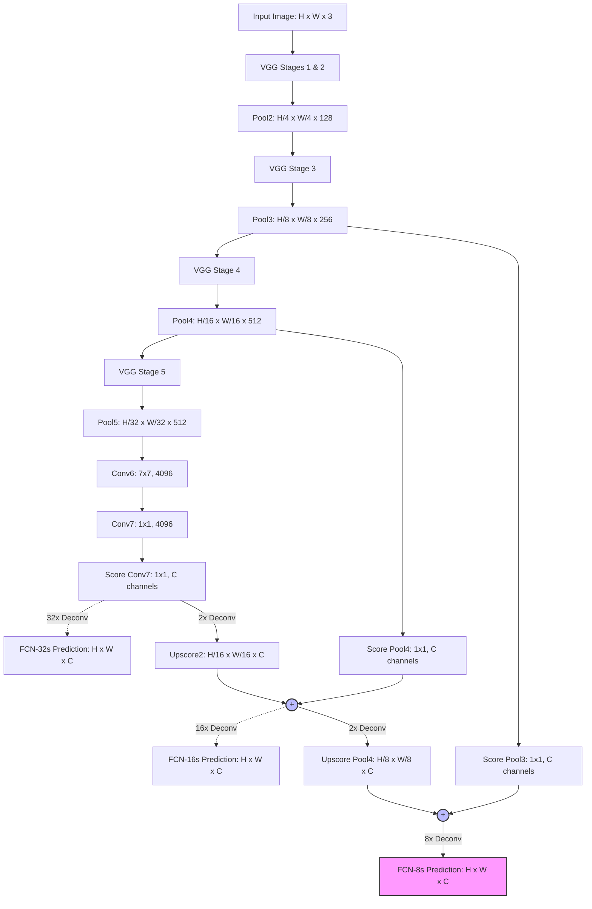

# 📄 Fully Convolutional Networks for Semantic Segmentation (FCN)

> **Paper Title:** Fully Convolutional Networks for Semantic Segmentation  
> **Authors:** Jonathan Long*, Evan Shelhamer*, Trevor Darrell (*Equal Contribution)  
> **Institutions:** UC Berkeley / Berkeley Vision and Learning Center (BVLC)  
> **Conference:** IEEE Conference on Computer Vision and Pattern Recognition (CVPR) 2015 (*Best Paper Honorable Mention*)  
> **ArXiv ID:** [arXiv:1411.4038](https://arxiv.org/abs/1411.4038)  
> **Official PDF:** [`1411.4038v2.pdf`](1411.4038v2.pdf)  
> **Milestone:** The seminal foundation of modern deep learning for semantic segmentation and dense pixel prediction (FCN-32s, FCN-16s, FCN-8s).

---

## 📑 Table of Contents

1. [Executive Summary & The Paradigm Shift](#1-executive-summary--the-paradigm-shift)
2. [Comprehensive Glossary of Terms (Beginner's Reference)](#2-comprehensive-glossary-of-terms-beginners-reference)
3. [The Semantic Segmentation Challenge: "What" vs. "Where"](#3-the-semantic-segmentation-challenge-what-vs-where)
4. [Core Innovation 1: "Convolutionalization" of Classification Nets](#4-core-innovation-1-convolutionalization-of-classification-nets)
   - [4.1 Why Traditional CNNs Fail at Dense Prediction](#41-why-traditional-cnns-fail-at-dense-prediction)
   - [4.2 Transforming Fully Connected Layers into Spatial Convolutions](#42-transforming-fully-connected-layers-into-spatial-convolutions)
   - [4.3 Handling Arbitrary Input Dimensions](#43-handling-arbitrary-input-dimensions)
   - [4.4 Mathematical Equivalence to Sliding Windows](#44-mathematical-equivalence-to-sliding-windows)
5. [Core Innovation 2: Upsampling via Transposed Convolutions](#5-core-innovation-2-upsampling-via-transposed-convolutions)
   - [5.1 The Resolution Dilemma: Why Downsampling Happens](#51-the-resolution-dilemma-why-downsampling-happens)
   - [5.2 Shift-and-Stitch vs. In-Network Upsampling](#52-shift-and-stitch-vs-in-network-upsampling)
   - [5.3 Mathematical Formulation of Transposed Convolutions ("Deconvolution")](#53-mathematical-formulation-of-transposed-convolutions-deconvolution)
   - [5.4 Bilinear Interpolation Kernels vs. Learnable Filters](#54-bilinear-interpolation-kernels-vs-learnable-filters)
6. [Core Innovation 3: Deep Skip Architectures (FCN-32s, 16s, 8s)](#6-core-innovation-3-deep-skip-architectures-fcn-32s-16s-8s)
   - [6.1 FCN-32s: Single-Stream Coarse Upsampling](#61-fcn-32s-single-stream-coarse-upsampling)
   - [6.2 FCN-16s: 2-Stream Fusion with Pool4](#62-fcn-16s-2-stream-fusion-with-pool4)
   - [6.3 FCN-8s: 3-Stream Fusion with Pool3 for Fine Spatial Detail](#63-fcn-8s-3-stream-fusion-with-pool3-for-fine-spatial-detail)
   - [6.4 Full Tensor Dimensions & Receptive Field Evolution](#64-full-tensor-dimensions--receptive-field-evolution)
7. [System Architecture & Tensor Flow](#7-system-architecture--tensor-flow)
   - [7.1 Architectural Schematic (ASCII & Mermaid)](#71-architectural-schematic-ascii--mermaid)
   - [7.2 Layer-by-Layer Parameter & Feature Map Registry](#72-layer-by-layer-parameter--feature-map-registry)
8. [Training Strategy & Loss Formulation](#8-training-strategy--loss-formulation)
   - [8.1 2D Pixel-Wise Multinomial Cross-Entropy Loss](#81-2d-pixel-wise-multinomial-cross-entropy-loss)
   - [8.2 Handling Void / Boundary Pixels](#82-handling-void--boundary-pixels)
   - [8.3 Whole-Image Training vs. Patchwise Sampling](#83-whole-image-training-vs-patchwise-sampling)
   - [8.4 Fine-Tuning Dynamics & Layer-Specific Learning Rates](#84-fine-tuning-dynamics--layer-specific-learning-rates)
9. [Concrete Numerical Walkthrough (End-to-End Hand Calculation)](#9-concrete-numerical-walkthrough-end-to-end-hand-calculation)
   - [9.1 Miniature Setup & Feature Map Dimensions](#91-miniature-setup--feature-map-dimensions)
   - [9.2 Forward Pass: Scoring with $1 \times 1$ Convolutions](#92-forward-pass-scoring-with-1-times-1-convolutions)
   - [9.3 Transposed Convolution (Bilinear $2\times$ Upsampling)](#93-transposed-convolution-bilinear-2times-upsampling)
   - [9.4 Skip Fusion: Element-Wise Addition](#94-skip-fusion-element-wise-addition)
   - [9.5 Pixel-Wise Softmax Probabilities](#95-pixel-wise-softmax-probabilities)
   - [9.6 Exact Cross-Entropy Loss Computation](#96-exact-cross-entropy-loss-computation)
10. [Beyond RGB: Multi-Modal & Multi-Task Extensions](#10-beyond-rgb-multi-modal--multi-task-extensions)
    - [10.1 NYUDv2 Depth Fusion & HHA Encoding](#101-nyudv2-depth-fusion--hha-encoding)
    - [10.2 SIFT Flow: Joint Semantic & Geometric Segmentation](#102-sift-flow-joint-semantic--geometric-segmentation)
11. [Experimental Results & Benchmark Analysis](#11-experimental-results--benchmark-analysis)
    - [11.1 Quantitative Metrics Defined (PA, MA, mIoU, FWIoU)](#111-quantitative-metrics-defined-pa-ma-miou-fwiou)
    - [11.2 PASCAL VOC 2011 & 2012 Leaderboard](#112-pascal-voc-2011--2012-leaderboard)
    - [11.3 Backbone Comparison: AlexNet vs. VGG-16 vs. GoogLeNet](#113-backbone-comparison-alexnet-vs-vgg-16-vs-googlenet)
12. [What Didn't Work & Ablation Findings](#12-what-didnt-work--ablation-findings)
    - [12.1 FCN-4s: The Limit of Skip Connections](#121-fcn-4s-the-limit-of-skip-connections)
    - [12.2 Patch Sampling vs. Whole Image SGD](#122-patch-sampling-vs-whole-image-sgd)
    - [12.3 Class Re-Weighting & Loss Scaling](#123-class-re-weighting--loss-scaling)
13. [Evolution Comparison Matrix](#13-evolution-comparison-matrix)
14. [Counter-Intuitive Quirks, Subtleties & Beginner FAQ](#14-counter-intuitive-quirks-subtleties--beginner-faq)
15. [Historical Impact & Lasting Legacy](#15-historical-impact--lasting-legacy)

---

## 1. Executive Summary & The Paradigm Shift

Before 2014, the deep learning revolution spearheaded by **AlexNet (2012)** and **VGGNet (2014)** dominated **whole-image classification**, but dense pixel-level tasks such as **Semantic Segmentation** remained stuck in complex, multi-stage pipelines. Existing methods relied on:
1. Hand-crafted region proposal engines (e.g., Selective Search, CPMC).
2. Extracting CNN features from thousands of cropped, warped bounding boxes independently.
3. Complex graphical models (Markov Random Fields / Conditional Random Fields) or superpixel classifiers to recover pixel boundaries.

These pipelines were computationally sluggish, disjointed, and incapable of true end-to-end optimization.

In their landmark CVPR 2015 paper, **Jonathan Long, Evan Shelhamer, and Trevor Darrell** proved that standard, off-the-shelf image classification networks could be repurposed into **Fully Convolutional Networks (FCNs)** capable of **end-to-end, pixel-to-pixel semantic segmentation**:

```
Traditional Classification CNN:
[ Image: 224x224x3 ] ──► [ Convolutions & Poolings ] ──► [ Flatten ] ──► [ Dense / FC Layers ] ──► 1D Vector (Class: "Cat")

Fully Convolutional Network (FCN):
[ Arbitrary Image: HxWx3 ] ──► [ Convolutions & Poolings ] ──► [ 1x1 Convs ] ──► [ Transposed Conv ] ──► Dense Map: HxWxC
                                                                     ▲                  │
                                                                     └── Skip Fusions ──┘
```

### The Three Core Tenets of FCN:
1. **Convolutionalization:** Converting all Fully Connected ($FC$) layers into spatial convolutional layers ($1 \times 1$ and $7 \times 7$). This removes fixed input size constraints, allowing the model to ingest images of arbitrary dimensions and output spatially organized score maps.
2. **In-Network Transposed Convolutions ("Deconvolutions"):** Efficient, learnable, fractionally-strided convolutions that upsample coarse feature maps back to full image resolution within the computational graph.
3. **Deep Skip Architecture:** Fusing deep, coarse, semantic information ("What") with shallow, fine, spatial information ("Where") across multiple network resolutions to form **FCN-32s**, **FCN-16s**, and **FCN-8s**.

The results shattered previous state-of-the-art accuracy on **PASCAL VOC 2012** (boosting Mean IoU from **45.6% to 62.2%**)—while performing inference in **under 200 ms** per image, orders of magnitude faster than prior patch-based methods.

---

## 2. Comprehensive Glossary of Terms (Beginner's Reference)

| Term | Symbol / Acronym | Mathematical / Technical Meaning | Intuitive Beginner Definition |
|:---|:---:|:---|:---|
| **Semantic Segmentation** | — | Dense classification task assigning a categorical label $c \in \{1, \dots, C\}$ to every pixel $(x, y)$. | Coloring every individual pixel in an image according to what object class it belongs to (e.g., person, dog, road). |
| **Fully Convolutional Network** | FCN | A neural network constructed strictly from shift-invariant operators (convolutions, poolings, element-wise activations). | A network without any flat "Dense/Linear" layers, enabling it to accept any image size and output a spatial 2D grid. |
| **Convolutionalization** | — | Mathematical transformation converting a dense matrix multiplication $W \in \mathbb{R}^{K_{in} \times K_{out}}$ into a convolution filter $W' \in \mathbb{R}^{K_{out} \times K_{in} \times h \times w}$. | Re-interpreting fixed-size fully connected layers as sliding filters so the network can process entire images of any resolution. |
| **Receptive Field** | $RF$ | The spatial area in the input image $I$ that determines the activation of a particular neuron in feature map $F$. | How much of the original photo a single neuron can "see" through all previous layers. |
| **Downsampling Factor / Stride** | $s$ | The cumulative subsampling ratio between input image dimensions and feature map dimensions: $s = \prod_{l} \text{stride}_l$. | How many times the image has been shrunk along its height and width (e.g., stride 32 means $32 \times 32$ pixels collapse to 1 cell). |
| **Transposed Convolution** | ConvTranspose2d / Deconvolution | An operation that maps low-resolution feature maps to higher-resolution feature maps by applying backward strided convolution. | A learnable, trainable form of upsampling that expands a tiny feature map into a big, full-resolution image. |
| **Bilinear Interpolation** | — | A 2D linear resampling technique estimating pixel values using the weighted average of the 4 nearest neighbors. | A simple mathematical formula to resize and smooth out an image without learning any parameters. |
| **Skip Connection** | — | Adding or concatenating activations from an earlier, higher-resolution layer directly to a later, lower-resolution layer. | A shortcut highway that brings fine edge and boundary details from shallow layers to fix blurriness in deep layers. |
| **FCN-32s** | — | Baseline FCN that directly upsamples the final stride-32 feature map (conv7/fc7) by $32\times$ in a single leap. | The simplest, coarsest FCN model; produces rough, blobby segmentations. |
| **FCN-16s** | — | 2-stream FCN combining $2\times$ upsampled stride-32 features with stride-16 pool4 features before upsampling $16\times$. | The medium-detail FCN model that sharpens object boundaries. |
| **FCN-8s** | — | 3-stream FCN combining FCN-16s features with stride-8 pool3 features before upsampling $8\times$. | The final, finest FCN model; produces sharp boundaries, limbs, and contours. |
| **Mean Intersection over Union** | $\text{mIoU}$ | Standard metric: $\frac{1}{C}\sum_i \frac{n_{ii}}{t_i + \sum_j n_{ji} - n_{ii}}$ measuring overlap between predicted and true masks. | The gold-standard score: overlap area divided by combined area, averaged across all object classes. |

---

## 3. The Semantic Segmentation Challenge: "What" vs. "Where"

Semantic segmentation embodies an inherent, fundamental contradiction in computer vision:

```
               THE SEMANTIC SEGMENTATION TENSION
               
   SHALLOW LAYERS (High Spatial Detail)          DEEP LAYERS (High Semantic Detail)
   ┌──────────────────────────────────┐          ┌──────────────────────────────────┐
   │ • High Spatial Resolution (H x W)│          │ • Low Spatial Resolution (H/32)  │
   │ • Precise Edges, Corners, Lines  │   VS.    │ • Highly Abstract Semantics      │
   │ • Weak Semantics (Doesn't know   │          │ • Strong Class Identity ("Horse")│
   │   what object the edge belongs to)│         │ • Completely Lost Spatial Origin │
   └──────────────────────────────────┘          └──────────────────────────────────┘
                 WHERE?                                         WHAT?
```

### The Conflict:
1. **The "What" Requirement:** To recognize that a group of pixels belongs to a "Bicycle" rather than a "Motorcycle", the network needs a **huge receptive field** and deep layers of non-linear abstraction. Successive pooling and strided convolutions downsample the image (typically by a factor of $32$), stripping out nuisance variations (lighting, texture, translation).
2. **The "Where" Requirement:** To draw a crisp boundary separating the bicycle tire from the road asphalt, the network needs **exact coordinate-level spatial localization**. However, downsampling by $32\times$ collapses every $32 \times 32$ pixel block into a single feature vector, obliterating fine boundaries!

Prior approaches tried to solve this either by:
- Operating on small sliding image patches (which recomputed identical convolutions thousands of times, wasting gigabytes of memory and minutes of compute per image).
- Running external superpixel or proposal algorithms, which introduced errors that could never be corrected by backpropagation.

**The FCN Breakthrough:** The authors showed that the network could achieve both **"What"** and **"Where"** simultaneously within a single, end-to-end differentiable computational graph using **convolutionalization**, **transposed convolutions**, and **cross-layer skip connections**.

---

## 4. Core Innovation 1: "Convolutionalization" of Classification Nets

### 4.1 Why Traditional CNNs Fail at Dense Prediction

Consider the canonical **VGG-16** architecture designed for ImageNet classification:
- Input image size is hardcoded to $224 \times 224 \times 3$.
- 13 convolutional layers with 5 max-pooling layers reduce spatial resolution:
  $$224 \times 224 \to 112 \times 112 \to 56 \times 56 \to 28 \times 28 \to 14 \times 14 \to 7 \times 7$$
- At the output of `pool5`, the feature map tensor has shape:
  $$\mathbf{X}_{\text{pool5}} \in \mathbb{R}^{7 \times 7 \times 512}$$
- Next comes the first Fully Connected layer (`fc6`):
  $$\mathbf{x}_{\text{flat}} = \text{Flatten}(\mathbf{X}_{\text{pool5}}) \in \mathbb{R}^{25,088}$$
  $$\mathbf{y}_{\text{fc6}} = \mathbf{W}_{\text{fc6}} \mathbf{x}_{\text{flat}} + \mathbf{b}_{\text{fc6}}, \quad \text{where } \mathbf{W}_{\text{fc6}} \in \mathbb{R}^{4096 \times 25,088}$$

**The Fatal Flaw:** The weight matrix $\mathbf{W}_{\text{fc6}}$ has exactly $25,088$ columns. If the user provides an input image of size $384 \times 384$, `pool5` will output a feature map of shape $12 \times 12 \times 512 = 73,728$ values. The matrix multiplication fails immediately due to an inner-dimension mismatch ($73,728 \neq 25,088$).

Furthermore, flattening destroys all 2D topological neighborhood relationships. The spatial location $(x, y)$ is discarded.

### 4.2 Transforming Fully Connected Layers into Spatial Convolutions

The core insight of Long et al. is that **a Fully Connected layer is simply a convolution with a kernel whose spatial size matches the entire spatial dimensions of its input feature map**:

$$\text{FC Layer } (C_{\text{in}} \times H \times W \to C_{\text{out}}) \equiv \text{Conv2D} \left(\text{in\_channels}=C_{\text{in}}, \text{out\_channels}=C_{\text{out}}, \text{kernel\_size}=(H, W)\right)$$

```
TRANSFORMING FC6 INTO A 7x7 CONVOLUTION:

Traditional FC6:
[ 7 x 7 x 512 ] ──► Flatten ──► [ Vector: 25,088 ] ──► Matrix Mult (4096 x 25,088) ──► [ 4096 ]

Convolutionalized FC6:
[ 7 x 7 x 512 ] ──► Conv2D (k=7x7, pad=0, 4096 filters) ───────────────────────────► [ 1 x 1 x 4096 ]
```

Similarly:
- **`fc7`** (originally $4096 \times 4096$ matrix): Converted to a $\mathbf{1 \times 1 \text{ Conv}}$ with 4096 filters.
- **`fc8`** (originally $1000 \times 4096$ classification head): Converted to a $\mathbf{1 \times 1 \text{ Conv}}$ with $C$ filters, where $C$ is the number of target semantic classes (e.g., $C = 21$ for PASCAL VOC: 20 object categories + 1 background class).

### 4.3 Handling Arbitrary Input Dimensions

Once the network is composed entirely of convolutional, pooling, and element-wise activation layers, **it becomes spatial-size agnostic**:

Let the input image have arbitrary spatial dimensions $H_{\text{in}} \times W_{\text{in}} \times 3$:
1. Passing through 5 pooling layers with stride 2 downsamples the input by a total factor of $2^5 = 32$.
2. The output of `conv7` (former `fc7`) is not a 1D vector, but a **2D spatial grid**:
   $$H_{\text{out}} = \left\lfloor \frac{H_{\text{in}}}{32} \right\rfloor, \quad W_{\text{out}} = \left\lfloor \frac{W_{\text{in}}}{32} \right\rfloor$$
3. Applying the final $1 \times 1$ scoring convolution outputs a tensor of shape:
   $$\mathbf{S} \in \mathbb{R}^{H_{\text{out}} \times W_{\text{out}} \times C}$$
   Every spatial location $(i, j)$ in this output tensor contains a $C$-dimensional vector representing the class logits for the corresponding receptive field region in the original image!

```
Arbitrary Input Sizing in Action:
Input Image: [ 512 x 512 x 3 ]
     │  (Stride 32 Backbone: VGG-16)
     ▼
conv7:        [ 16 x 16 x 4096 ]
     │  (1x1 Conv with C=21 filters)
     ▼
Class Logits: [ 16 x 16 x 21 ]  <── Coarse 2D semantic grid!
```

### 4.4 Mathematical Equivalence to Sliding Windows

Before FCN, practitioners who wanted dense spatial predictions took a standard classification CNN and slid it across overlapping patches of a large image. 

Let an image $I$ be evaluated at sliding window positions spaced by stride $s$.
- If you compute the forward pass for each window independently, redundant features are calculated over and over again in every shared receptive field.
- For two overlapping patches $P_1$ and $P_2$, almost $90\%$ of the convolutional floating-point operations (FLOPs) are identical!

**The Convolutional Equivalence Proof:**
Let $f_l$ denote the transformation computed by convolutional layer $l$:
$$f_l(\mathbf{x}) = \sigma(\mathbf{W}_l * \mathbf{x} + \mathbf{b}_l)$$
Because convolution is a linear, shift-equivariant operator:
$$f_l(\text{Shift}_\tau(\mathbf{x})) = \text{Shift}_\tau(f_l(\mathbf{x}))$$
Running the convolutionalized network once over the entire $H \times W$ image produces the exact same spatial grid of outputs as sliding the original network across every window—**with zero redundant computation!**

The authors measured this efficiency gain: evaluating an image via FCN is over **$5\times$ faster** than the fastest patch-based sliding window implementations.

---

## 5. Core Innovation 2: Upsampling via Transposed Convolutions

### 5.1 The Resolution Dilemma: Why Downsampling Happens

Why not simply remove all pooling layers from VGG-16 to preserve full $H \times W$ resolution throughout?
- **Receptive Field Collapse:** A $3 \times 3$ convolution without pooling only increases the receptive field by 2 pixels per layer. To see an entire object (e.g., a bus spanning $300 \times 300$ pixels), the network would require hundreds of layers. Pooling expands the receptive field exponentially.
- **Computational Explosion:** Processing high-channel feature maps ($512$ channels) at full $512 \times 512$ resolution would require hundreds of gigabytes of VRAM and drastically slow down training.

Therefore, downsampling is biologically and mathematically necessary to build invariant semantic representations. The problem becomes: **How do we upsample coarse feature maps back to pixel-level resolution?**

### 5.2 Shift-and-Stitch vs. In-Network Upsampling

The paper explicitly contrasts two potential upsampling paradigms:

#### 1. Shift-and-Stitch (The OverFeat Trick)
If a network downsamples by factor $f = 32$:
- Shift the input image by $x \in \{0, 1, \dots, f-1\}$ and $y \in \{0, 1, \dots, f-1\}$.
- Forward all $f^2 = 32^2 = 1024$ shifted images through the network.
- Interlace (stitch) the resulting coarse predictions into a single dense grid.
- **Disadvantage:** Incredibly wasteful. Running 1024 forward passes per image makes real-time or scalable training impossible.

#### 2. In-Network Upsampling (Transposed Convolution)
Rather than shifting inputs, upsample feature maps directly inside the network using a single, unified operation.

### 5.3 Mathematical Formulation of Transposed Convolutions ("Deconvolution")

Transposed convolution (often called **backward strided convolution**, **fractionally strided convolution**, or colloquially **deconvolution**) reverses the spatial downsampling of standard strided convolutions.

```
FORWARD STRIDED CONVOLUTION (Downsampling by 2):
Input:  [ x0  x1  x2  x3 ]
Kernel: [ w0  w1 ]
Stride: 2
Output: [ y0  y1 ]
where:
y0 = w0*x0 + w1*x1
y1 = w0*x2 + w1*x3

Matrix Formulation:
y = C * x
┌    ┐   ┌             ┐ ┌    ┐
│ y0 │ = │ w0 w1  0  0 │ │ x0 │
│ y1 │   │  0  0 w0 w1 │ │ x1 │
└    ┘   └             ┘ │ x2 │
                         │ x3 │
                         └    ┘
                         
TRANSPOSED CONVOLUTION (Upsampling by 2):
Input:  [ y0  y1 ]
We multiply by C^T (The Transpose Matrix):
x_hat = C^T * y
┌      ┐   ┌       ┐
│ x0_h │   │ w0  0 │
│ x1_h │ = │ w1  0 │ ┌    ┐
│ x2_h │   │  0 w0 │ │ y0 │
│ x3_h │   │  0 w1 │ │ y1 │
└      ┘   └       ┘ └    ┘
x0_h = w0 * y0
x1_h = w1 * y0
x2_h = w0 * y1
x3_h = w1 * y1
```

#### The Spatial Equation for 2D Transposed Convolution:
Given an input feature map $X$ of size $H_{\text{in}} \times W_{\text{in}}$, a kernel $K$ of size $k \times k$, stride $s$, and padding $p$, the output dimensions are:

$$H_{\text{out}} = (H_{\text{in}} - 1) \times s - 2p + k$$
$$W_{\text{out}} = (W_{\text{in}} - 1) \times s - 2p + k$$

To achieve an exact integer scaling factor $s$ (e.g., $H_{\text{out}} = s \cdot H_{\text{in}}$), the kernel size and padding are typically set such that:
$$k = 2s, \quad p = \frac{s}{2}$$
For an upsampling factor of $2\times$ ($s=2$):
$$k = 4, \quad p = 1 \implies H_{\text{out}} = (H_{\text{in}} - 1) \times 2 - 2(1) + 4 = 2H_{\text{in}}$$

### 5.4 Bilinear Interpolation Kernels vs. Learnable Filters

A key contribution of the paper is proving that **standard bilinear interpolation is merely a fixed special case of transposed convolution!**

For a 1D kernel of size $k$ with upsampling factor $f = s$:
$$w(\tau) = 1 - \left| \frac{\tau}{f} - \frac{k \% 2}{2f} \right|$$

For a 2D bilinear interpolation kernel, the 2D filter is the outer product of two 1D triangular filters:
$$W(x, y) = \left( 1 - \left| \frac{x - c_x}{f} \right| \right) \left( 1 - \left| \frac{y - c_y}{f} \right| \right)$$
where $c_x, c_y$ are the kernel center coordinates.

```
Example: 2D Bilinear Kernel for 2x Upsampling (Kernel Size 4x4, Stride 2):
┌                       ┐
│ 0.06  0.19  0.19 0.06 │
│ 0.19  0.56  0.56 0.19 │
│ 0.19  0.56  0.56 0.19 │
│ 0.06  0.19  0.19 0.06 │
└                       ┘
(Normalized such that weights in each receptive field sum to 1.0)
```

**The FCN Training Strategy:**
1. The transposed convolution layers can be **initialized directly with bilinear interpolation weights**.
2. During training, the gradients from the pixel-wise cross-entropy loss backpropagate into these weights:
   $$\frac{\partial \mathcal{L}}{\partial W_{\text{deconv}}} = \sum_{x, y} \frac{\partial \mathcal{L}}{\partial \hat{Y}_{x, y}} \cdot X_{\text{in}}$$
3. The network can therefore **learn non-linear, task-specific reconstruction filters** that outperform standard mathematical interpolation!

---

## 6. Core Innovation 3: Deep Skip Architectures (FCN-32s, 16s, 8s)

Upsampling directly from the final layer yields a model named **FCN-32s**. While it predicts semantic classes correctly, its boundaries are coarse and blocky. To resolve fine details, Long et al. introduced **Skip Connections** that combine predictions across multiple strides.

```
THE SKIP CONNECTION HIERARCHY
┌─────────────────────────────────────────────────────────────────────────────┐
│ Image [H x W x 3]                                                           │
│   │                                                                         │
│   ▼                                                                         │
│ [conv1 - pool1]  (Stride 2)                                                 │
│   │                                                                         │
│   ▼                                                                         │
│ [conv2 - pool2]  (Stride 4)                                                 │
│   │                                                                         │
│   ▼                                                                         │
│ [conv3 - pool3]  (Stride 8)  ────────────────────────┐                      │
│   │                                                  │ 1x1 Conv (Score)     │
│   ▼                                                  ▼                      │
│ [conv4 - pool4]  (Stride 16) ────────┐          [Pool3 Score]               │
│   │                                  │ 1x1 Conv      │                      │
│   ▼                                  ▼               │                      │
│ [conv5 - pool5]  (Stride 32)    [Pool4 Score]        │                      │
│   │                                  │               │                      │
│   ▼                                  │               │                      │
│ [conv6 - conv7] (Stride 32)          │               │                      │
│   │                                  │               │                      │
│   ▼ 1x1 Conv (Score)                 │               │                      │
│ [Conv7 Score]                        │               │                      │
│   │                                  │               │                      │
│   ├──────────────────────────┐       │               │                      │
│   │ 32x Deconv               │ 2x    │               │                      │
│   ▼                          ▼       │               │                      │
│ [FCN-32s Output]          [Sum 1]◄───┘               │                      │
│ (Stride 1, Coarse)           │                       │                      │
│                              ├───────────────┐       │                      │
│                              │ 16x Deconv    │ 2x    │                      │
│                              ▼               ▼       │                      │
│                           [FCN-16s Output] [Sum 2]◄──┘                      │
│                           (Stride 1)         │                              │
│                                              │ 8x Deconv                    │
│                                              ▼                              │
│                                           [FCN-8s Output]                   │
│                                           (Stride 1, Fine Detail)           │
└─────────────────────────────────────────────────────────────────────────────┘
```

### 6.1 FCN-32s: Single-Stream Coarse Upsampling
- **Path:** Takes the output of `conv7`, applies a $1 \times 1$ convolution to produce $C$ score channels at stride 32, and upsamples directly to image resolution using a **stride-32 transposed convolution** with kernel size $64 \times 64$.
- **Limitation:** A single pixel in `conv7` represents a $32 \times 32$ block of input pixels. The upsampled mask resembles a smooth, blurry blob that fails to capture object edges.

### 6.2 FCN-16s: 2-Stream Fusion with Pool4
- **Path:**
  1. The stride-32 score map from `conv7` is upsampled by **$2\times$** using a stride-2 transposed convolution (bringing its stride to 16).
  2. A $1 \times 1$ convolutional scoring layer is attached to `pool4` (which naturally operates at stride 16) to output $C$ class channels.
  3. The two stride-16 score maps are merged via **element-wise addition**:
     $$\mathbf{S}_{\text{fuse16}} = \text{ConvTranspose}_{2\times}(\mathbf{S}_{\text{conv7}}) \oplus \text{Score}_{1\times 1}(\mathbf{X}_{\text{pool4}})$$
  4. The fused representation $\mathbf{S}_{\text{fuse16}}$ is upsampled by **$16\times$** back to the original image dimensions.
- **Improvement:** Fusing `pool4` restores structural geometry that was lost in the deeper layers.

### 6.3 FCN-8s: 3-Stream Fusion with Pool3 for Fine Spatial Detail
- **Path:**
  1. The fused stride-16 score map $\mathbf{S}_{\text{fuse16}}$ is upsampled by **$2\times$** (bringing its stride to 8).
  2. A $1 \times 1$ convolutional scoring layer is attached to `pool3` (stride 8) to output $C$ class channels.
  3. The two stride-8 score maps are merged via **element-wise addition**:
     $$\mathbf{S}_{\text{fuse8}} = \text{ConvTranspose}_{2\times}(\mathbf{S}_{\text{fuse16}}) \oplus \text{Score}_{1\times 1}(\mathbf{X}_{\text{pool3}})$$
  4. The final fused score map $\mathbf{S}_{\text{fuse8}}$ is upsampled by **$8\times$** back to full image resolution.
- **Result:** FCN-8s recovers thin structures like bicycle spokes, chair legs, and crisp object silhouettes.

### 6.4 Full Tensor Dimensions & Receptive Field Evolution

Assuming an input image of dimensions $512 \times 512 \times 3$:

| Layer Name | Type | Kernel / Stride | Output Shape $(H \times W \times C)$ | Effective Stride | Receptive Field ($RF$) |
|:---|:---:|:---:|:---:|:---:|:---:|
| **Input Image** | Input | — | $512 \times 512 \times 3$ | 1 | 1 |
| **conv1_1, conv1_2** | Conv-ReLU | $3 \times 3, s=1$ | $512 \times 512 \times 64$ | 1 | 5 |
| **pool1** | MaxPool | $2 \times 2, s=2$ | $256 \times 256 \times 64$ | 2 | 6 |
| **conv2_1, conv2_2** | Conv-ReLU | $3 \times 3, s=1$ | $256 \times 256 \times 128$ | 2 | 14 |
| **pool2** | MaxPool | $2 \times 2, s=2$ | $128 \times 128 \times 128$ | 4 | 16 |
| **conv3_1 ... 3_3** | Conv-ReLU | $3 \times 3, s=1$ | $128 \times 128 \times 256$ | 4 | 40 |
| **pool3** | MaxPool | $2 \times 2, s=2$ | $64 \times 64 \times 256$ | **8** | **44** |
| **conv4_1 ... 4_3** | Conv-ReLU | $3 \times 3, s=1$ | $64 \times 64 \times 512$ | 8 | 92 |
| **pool4** | MaxPool | $2 \times 2, s=2$ | $32 \times 32 \times 512$ | **16** | **100** |
| **conv5_1 ... 5_3** | Conv-ReLU | $3 \times 3, s=1$ | $32 \times 32 \times 512$ | 16 | 196 |
| **pool5** | MaxPool | $2 \times 2, s=2$ | $16 \times 16 \times 512$ | **32** | **212** |
| **conv6 (ex-fc6)** | Conv-ReLU-Drop | $7 \times 7, s=1$ | $16 \times 16 \times 4096$ | 32 | 404 |
| **conv7 (ex-fc7)** | Conv-ReLU-Drop | $1 \times 1, s=1$ | $16 \times 16 \times 4096$ | 32 | 404 |
| **score_conv7** | Conv2D | $1 \times 1, s=1$ | $16 \times 16 \times 21$ | 32 | 404 |
| **score_pool4** | Conv2D | $1 \times 1, s=1$ | $32 \times 32 \times 21$ | 16 | 100 |
| **score_pool3** | Conv2D | $1 \times 1, s=1$ | $64 \times 64 \times 21$ | 8 | 44 |
| **upscore2** | TransposedConv | $4 \times 4, s=2$ | $32 \times 32 \times 21$ | 16 | — |
| **fuse_pool4** | Eltwise Add | — | $32 \times 32 \times 21$ | 16 | Multi-scale |
| **upscore_pool4** | TransposedConv | $4 \times 4, s=2$ | $64 \times 64 \times 21$ | 8 | — |
| **fuse_pool3** | Eltwise Add | — | $64 \times 64 \times 21$ | 8 | Multi-scale |
| **upscore8 (final)** | TransposedConv | $16 \times 16, s=8$| $\mathbf{512 \times 512 \times 21}$ | **1** | Multi-scale |

> [!NOTE]
> The effective receptive field of `conv6` is $404 \times 404$ pixels. This enormous context window allows every prediction cell in `score_conv7` to "see" virtually the entire $512 \times 512$ scene!

---

## 7. System Architecture & Tensor Flow

### 7.1 Architectural Schematic (Mermaid Flowchart)



---

## 8. Training Strategy & Loss Formulation

### 8.1 2D Pixel-Wise Multinomial Cross-Entropy Loss

FCN treats semantic segmentation as a dense 2D classification task. Let:
- $\mathbf{z}_{i, j} \in \mathbb{R}^C$ be the vector of unnormalized logits at spatial coordinate $(i, j)$.
- $p_{i, j, c}$ be the softmax probability assigned to class $c \in \{1, \dots, C\}$ at pixel $(i, j)$:
  $$p_{i, j, c} = \frac{\exp(z_{i, j, c})}{\sum_{k=1}^C \exp(z_{i, j, k})}$$
- $y_{i, j} \in \{1, \dots, C\}$ be the true ground-truth class label at pixel $(i, j)$.

The total training loss $\mathcal{L}$ across an image with valid pixel set $\Omega$ is the sum (or average) of pixel-wise cross-entropy losses:

$$\mathcal{L}(\mathbf{W}) = - \frac{1}{|\Omega|} \sum_{(i, j) \in \Omega} \log \left( p_{i, j, y_{i, j}} \right) = - \frac{1}{|\Omega|} \sum_{(i, j) \in \Omega} \left[ z_{i, j, y_{i, j}} - \log \left( \sum_{k=1}^C \exp(z_{i, j, k}) \right) \right]$$

#### Analytical Gradients:
The gradient of the loss with respect to logit $z_{i, j, c}$ is remarkably clean:

$$\frac{\partial \mathcal{L}}{\partial z_{i, j, c}} = \frac{1}{|\Omega|} \left( p_{i, j, c} - \mathbb{I}(y_{i, j} == c) \right)$$

where $\mathbb{I}(\cdot)$ is the indicator function. The error signal fed backward into each pixel is simply:
$$\text{Error} = \text{Predicted Probability} - \text{Ground Truth Target (1.0 or 0.0)}$$

### 8.2 Handling Void / Boundary Pixels

In standard segmentation datasets like PASCAL VOC:
- Pixels inside an object boundary belong to the object class (e.g., Cat $= 8$).
- Background pixels belong to class $0$.
- **Boundary / Ambiguous Pixels:** A border of 5 pixels around every object silhouette is labeled with a special **Void label** ($255$).
- In FCN, pixels with $y_{i, j} = 255$ are **masked out** of $\Omega$. No loss is calculated for them, and zero gradient is backpropagated:
  $$\frac{\partial \mathcal{L}}{\partial z_{i, j, c}} = 0 \quad \forall (i, j) \notin \Omega$$

### 8.3 Whole-Image Training vs. Patchwise Sampling

A major debate in 2014 was whether deep segmentation networks should be trained on whole images or sampled patches.

```
Patchwise Sampling:
Image ──► Randomly Crop 256 Patches (e.g. 64x64) ──► Forward Each Independently
Flaws: Massive overlapping computation, narrow context, slow epochs.

Whole-Image Training (FCN):
Image [H x W x 3] ──► Single Forward Pass ──► Dense Loss Map [H x W] ──► Single Backward Pass
Benefits: 100% computational reuse, global context, naturally batches spatial gradients.
```

The authors experimentally tested subsampling the loss grid (e.g., computing loss on only 1 out of every 8 spatial locations). They discovered that **whole-image training with SGD without any spatial patch subsampling converges faster, achieves higher final accuracy, and requires vastly less wall-clock time!**

### 8.4 Fine-Tuning Dynamics & Layer-Specific Learning Rates

Training an FCN from scratch on small segmentation datasets (e.g., PASCAL VOC with ~1,500 training images) leads to catastrophic overfitting. Instead, FCN relies on **ImageNet pre-trained representations**:

1. **Backbone Weights:** Pre-trained on ILSVRC-2012 (VGG-16).
2. **Convolutionalized Layers (`conv6`, `conv7`):** Weights transferred directly from `fc6` and `fc7`.
3. **Scoring Convolutions ($1 \times 1$):** Initialized from scratch with Gaussian noise ($\mu = 0, \sigma = 0.01$) or Xavier initialization, with zero bias.
4. **Transposed Convolutions:** Initialized with fixed 2D bilinear interpolation kernels.
5. **Optimization Hyperparameters:**
   - **Optimizer:** Stochastic Gradient Descent (SGD) with momentum $\beta = 0.9$.
   - **Base Learning Rate:** $10^{-4}$ for FCN-VGG16 (and $10^{-3}$ for FCN-AlexNet).
   - **Weight Decay:** $5 \times 10^{-4}$.
   - **Batch Size:** 20 images for AlexNet; **1 image** for VGG-16 (accumulating gradients over spatial dimensions).
   - **High Learning Rate for Score Layers:** Newly initialized $1 \times 1$ conv layers use a learning rate multiplier of $2\times$ or $10\times$ relative to the backbone to allow rapid adaptation to the segmentation task.

---

## 9. Concrete Numerical Walkthrough (End-to-End Hand Calculation)

To understand exactly how the mathematics operate at runtime, let us walk through a complete, concrete numerical example with realistic small tensors.

### 9.1 Miniature Setup & Feature Map Dimensions

- **Image:** Miniature patch of an image.
- **Classes ($C=2$):** Class 0 (Background) and Class 1 (Object / Person).
- Consider an intermediate feature map where:
  - Stride 16 feature map (`pool4`) has spatial size $2 \times 2$.
  - Stride 32 feature map (`conv7`) has spatial size $1 \times 1$.
  - Desired target output resolution is $4 \times 4$.

```
Spatial Dimensions:
conv7 score (stride 32): 1 x 1
pool4 score (stride 16): 2 x 2
Target Output:           4 x 4
```

### 9.2 Forward Pass: Scoring with $1 \times 1$ Convolutions

Suppose the single spatial location in `conv7` outputs feature vector:
$$\mathbf{x}_{\text{conv7}} = [1.2, -0.5] \in \mathbb{R}^2$$

The $1 \times 1$ scoring conv has weights $\mathbf{W}_{\text{score7}} \in \mathbb{R}^{2 \times 2}$ and bias $\mathbf{b} = [0, 0]$:
$$\mathbf{W}_{\text{score7}} = \begin{bmatrix} 1.0 & 0.5 \\ -0.5 & 1.5 \end{bmatrix}$$

The resulting $1 \times 1$ score map $\mathbf{S}_{\text{conv7}}$ is:
$$\mathbf{S}_{\text{conv7}}[0, 0] = \begin{bmatrix} (1.0)(1.2) + (0.5)(-0.5) \\ (-0.5)(1.2) + (1.5)(-0.5) \end{bmatrix} = \begin{bmatrix} 1.2 - 0.25 \\ -0.6 - 0.75 \end{bmatrix} = \begin{bmatrix} 0.95 \\ -1.35 \end{bmatrix}$$
Here, channel 0 has logit $+0.95$ (background), and channel 1 has logit $-1.35$ (person).

### 9.3 Transposed Convolution (Bilinear $2\times$ Upsampling)

We upsample $\mathbf{S}_{\text{conv7}}$ from $1 \times 1$ to $2 \times 2$ using a $2\times$ transposed convolution.
Using bilinear interpolation, a single scalar value expands uniformly to all 4 neighboring cells:

$$\mathbf{S}_{\text{up\_conv7}} \in \mathbb{R}^{2 \times 2 \times 2}$$

For Channel 0 ($z=0.95$):
$$\mathbf{S}_{\text{up\_conv7}}[:, :, 0] = \begin{bmatrix} 0.95 & 0.95 \\ 0.95 & 0.95 \end{bmatrix}$$

For Channel 1 ($z=-1.35$):
$$\mathbf{S}_{\text{up\_conv7}}[:, :, 1] = \begin{bmatrix} -1.35 & -1.35 \\ -1.35 & -1.35 \end{bmatrix}$$

### 9.4 Skip Fusion: Element-Wise Addition

Now suppose `pool4` (which is already $2 \times 2$) was scored by its own $1 \times 1$ convolution, producing:

$$\mathbf{S}_{\text{pool4}}[:, :, 0] \text{ (Channel 0: Background)} = \begin{bmatrix} 0.50 & -0.20 \\ 0.40 & -0.60 \end{bmatrix}$$
$$\mathbf{S}_{\text{pool4}}[:, :, 1] \text{ (Channel 1: Person)}     = \begin{bmatrix} -0.30 & 0.80 \\ -0.10 & 1.10 \end{bmatrix}$$

We perform **element-wise addition** to fuse both streams:
$$\mathbf{S}_{\text{fuse16}} = \mathbf{S}_{\text{up\_conv7}} \oplus \mathbf{S}_{\text{pool4}}$$

#### Fused Channel 0 (Background):
$$\mathbf{S}_{\text{fuse16}}[:, :, 0] = \begin{bmatrix} 0.95 + 0.50 & 0.95 - 0.20 \\ 0.95 + 0.40 & 0.95 - 0.60 \end{bmatrix} = \begin{bmatrix} 1.45 & 0.75 \\ 1.35 & 0.35 \end{bmatrix}$$

#### Fused Channel 1 (Person):
$$\mathbf{S}_{\text{fuse16}}[:, :, 1] = \begin{bmatrix} -1.35 - 0.30 & -1.35 + 0.80 \\ -1.35 - 0.10 & -1.35 + 1.10 \end{bmatrix} = \begin{bmatrix} -1.65 & -0.55 \\ -1.45 & -0.25 \end{bmatrix}$$

> [!TIP]
> Notice the top-right pixel $(0, 1)$: `conv7` initially thought it was Background ($0.95$ vs $-1.35$). However, `pool4` observed fine detail of a person ($+0.80$ vs $-0.20$). After fusion, the Person logit rose from $-1.35$ to $-0.55$, demonstrating how skip connections refine decisions!

### 9.5 Pixel-Wise Softmax Probabilities

Let us inspect the bottom-right pixel $(1, 1)$:
- Logit for Class 0 (Background): $z_0 = 0.35$
- Logit for Class 1 (Person): $z_1 = -0.25$

Compute softmax denominator:
$$\sum_{k=0}^1 e^{z_k} = e^{0.35} + e^{-0.25} \approx 1.41907 + 0.77880 = 2.19787$$

Compute predicted probabilities:
$$p_0 = \frac{e^{0.35}}{2.19787} = \frac{1.41907}{2.19787} \approx \mathbf{0.6457} \quad (64.57\% \text{ Background})$$
$$p_1 = \frac{e^{-0.25}}{2.19787} = \frac{0.77880}{2.19787} \approx \mathbf{0.3543} \quad (35.43\% \text{ Person})$$

### 9.6 Exact Cross-Entropy Loss Computation

Assume the ground-truth annotation for pixel $(1, 1)$ is $y = 1$ (Person).
The cross-entropy loss for this individual pixel is:

$$\ell_{(1, 1)} = - \log(p_1) = - \log(0.3543) \approx \mathbf{1.0376}$$

#### Gradient with Respect to Logits:
$$\frac{\partial \ell}{\partial z_0} = p_0 - 0 = \mathbf{+0.6457}$$
$$\frac{\partial \ell}{\partial z_1} = p_1 - 1 = 0.3543 - 1.0 = \mathbf{-0.6457}$$

- The gradient for $z_0$ is **positive** ($+0.6457$), which pushes the Background logit down during gradient descent ($\Delta z_0 = -\eta \frac{\partial \ell}{\partial z_0}$).
- The gradient for $z_1$ is **negative** ($-0.6457$), which pulls the Person logit up!
- These clean gradients flow seamlessly through both the transposed convolution and the `pool4` skip connection back to the very first convolutional layer of the network.

---

## 10. Beyond RGB: Multi-Modal & Multi-Task Extensions

The beauty of the fully convolutional formulation is that it extends naturally beyond simple RGB semantic segmentation.

### 10.1 NYUDv2 Depth Fusion & HHA Encoding

The **NYU Depth v2** dataset contains 1,449 indoor RGB-D scenes. How can depth information be incorporated into an FCN?

```
RGB-D Fusion Strategies:
1. Early Fusion: Concatenate Depth as a 4th channel [R, G, B, D].
   Problem: Pre-trained ImageNet weights cannot ingest 4-channel inputs without retraining conv1.
2. Late Fusion: Run separate CNN on Depth, fuse features at conv7.
3. HHA Geocoded Depth Encoding (The Authors' Winning Approach):
```

The authors converted raw depth into a 3-channel **HHA image**:
1. **H (Horizontal Disparity):** Pixel disparity related to depth.
2. **H (Height Above Ground):** Estimated physical distance from the floor in meters.
3. **A (Angle with Gravity):** Surface normal vector angle relative to the gravity vector.

```
                  RGB Stream (Pretrained VGG-16)
               ┌──────────────────────────────────┐
RGB Image ────►│ conv1 ... pool5 ... conv7 Score  │──┐
               └──────────────────────────────────┘  │ Eltwise
                                                     ├──► Final Predictions
               ┌──────────────────────────────────┐  │    (mIoU: 34.0%)
HHA Image ────►│ conv1 ... pool5 ... conv7 Score  │──┘
               └──────────────────────────────────┘
                  HHA Stream (Pretrained VGG-16)
```

By encoding depth into HHA (which has color-like continuous spatial structure) and fusing predictions from two parallel VGG-16 streams, the authors established a new state-of-the-art on NYUDv2, achieving **$34.0\%$ Mean IoU**.

### 10.2 SIFT Flow: Joint Semantic & Geometric Segmentation

The **SIFT Flow** dataset requires predicting two distinct properties simultaneously:
1. **Semantic Categories:** 33 categories (bridge, building, car, person, tree, etc.).
2. **Geometric Categories:** 3 surface orientation classes (horizontal, vertical, sky).

The authors trained a single FCN with a **shared representation and two separate scoring heads**:

$$\mathcal{L}_{\text{total}} = \mathcal{L}_{\text{semantic}} + \lambda \mathcal{L}_{\text{geometric}}$$

- Shared backbone up to `conv7`.
- `score_semantic` ($1 \times 1$ conv with 33 outputs).
- `score_geometric` ($1 \times 1$ conv with 3 outputs).
- Results: Pixel Accuracy reached **$85.9\%$**, outperforming dedicated, complex MRF models that took minutes per image.

---

## 11. Experimental Results & Benchmark Analysis

### 11.1 Quantitative Metrics Defined

The paper evaluates models using four standard metrics. Let:
- $n_{ij}$ be the number of pixels of true class $i$ predicted as class $j$.
- $n_{cl}$ be the number of classes.
- $t_i = \sum_j n_{ij}$ be the total number of pixels of class $i$.

| Metric Name | Mathematical Definition | Focus |
|:---|:---:|:---|
| **Pixel Accuracy (PA)** | $\frac{\sum_i n_{ii}}{\sum_i t_i}$ | Percentage of all pixels correctly classified across the entire dataset. Dominated by large background classes. |
| **Mean Accuracy (MA)** | $\frac{1}{n_{cl}} \sum_i \frac{n_{ii}}{t_i}$ | Class-averaged accuracy. Prevents small classes from being hidden by large classes. |
| **Mean Intersection over Union (mIoU)** | $\frac{1}{n_{cl}} \sum_i \frac{n_{ii}}{t_i + \sum_j n_{ji} - n_{ii}}$ | **The standard benchmark metric.** Penalizes both false positives and false negatives for every class. |
| **Frequency Weighted IoU (FWIoU)** | $\frac{1}{\sum_k t_k} \sum_i \frac{t_i \cdot n_{ii}}{t_i + \sum_j n_{ji} - n_{ii}}$ | IoU weighted by the prevalence/frequency of each class. |

### 11.2 PASCAL VOC 2011 & 2012 Leaderboard

On the gold-standard PASCAL VOC 2011 and 2012 segmentation challenges, FCN established a historic performance leap:

```
PASCAL VOC 2012 Test Set (Mean IoU %):
▲ Mean IoU (%)
│
│                                           [FCN-8s] (62.2%)  ◄── Landmark Leap!
│                           [FCN-16s] (59.4%)
│           [FCN-32s] (54.3%)
│
│ [SDS] (51.6%)
│
│ [R-CNN Seg] (47.9%)
│
│ [O2P] (45.6%)  ◄── Best Pre-FCN Handcrafted/Feature Pipeline
└─────────────────────────────────────────────────────────────► Year (2012 - 2015)
```

| Method | Mean IoU (%) (VOC 2012 Test) | Inference Speed (seconds / image) | End-to-End Trainable? |
|:---|:---:|:---:|:---:|
| **O2P (Carreira et al., 2012)** | 45.6% | ~60 s | No (Handcrafted + SVM) |
| **R-CNN Seg (Girshick et al., 2014)** | 47.9% | ~45 s | No (Proposals + Warping) |
| **SDS (Hariharan et al., 2014)** | 51.6% | ~40 s | No (MCG Proposals + CNN) |
| **FCN-32s (VGG-16)** | 54.3% | **0.17 s (170 ms)** | **Yes (End-to-End)** |
| **FCN-16s (VGG-16)** | 59.4% | **0.17 s (170 ms)** | **Yes (End-to-End)** |
| **FCN-8s (VGG-16)** | **62.2%** | **0.17 s (170 ms)** | **Yes (End-to-End)** |

> [!IMPORTANT]
> FCN improved segmentation accuracy by **+16.6% absolute mIoU** over the best prior non-FCN system (O2P) while running **over 300 times faster**!

### 11.3 Backbone Comparison: AlexNet vs. VGG-16 vs. GoogLeNet

The authors analyzed how the pre-trained classification backbone impacts segmentation performance:

| Backbone Net | Top-1 ImageNet Val Error | PASCAL VOC 2011 Val Mean IoU (%) | Parameter Count | Forward Pass Time (GPU) |
|:---|:---:|:---:|:---:|:---:|
| **AlexNet** | 42.6% | 39.8% | ~60 M | **35 ms** |
| **GoogLeNet (Inception v1)** | 31.1% | 46.2% | ~7 M | 60 ms |
| **VGG-16** | **28.5%** | **62.2%** | ~138 M | 170 ms |

#### Key Takeaways:
- Classification accuracy directly correlates with semantic segmentation capability.
- VGG-16 was significantly superior to AlexNet (+22.4% mIoU) due to its deeper feature hierarchy and small $3 \times 3$ receptive filters.
- Although GoogLeNet had far fewer parameters, adapting its complex multi-branch inception modules and auxiliary losses was less straightforward than VGG's clean sequential pipeline.

---

## 12. What Didn't Work & Ablation Findings

The paper includes critical negative results and engineering lessons that shaped future research:

### 12.1 FCN-4s: The Limit of Skip Connections
After observing that **FCN-16s** improved over FCN-32s, and **FCN-8s** improved over FCN-16s, the natural question was: *Why not continue to FCN-4s (fusing pool2 at stride 4) and FCN-2s?*
- **The Finding:** The authors constructed **FCN-4s** by fusing `pool2` features. The resulting performance showed **diminishing returns** (mIoU increased by less than $0.1\%$).
- **The Explanation:** By `pool2`, the receptive field is very small ($16 \times 16$), and the features represent low-level Gabor-like edges and color textures without semantic context. Fusing raw low-level noise into high-level semantic scores provided no net benefit and increased memory overhead.

### 12.2 Patch Sampling vs. Whole Image SGD
The authors tested whether randomly sampling patches during training (to mimic class balance or reduce gradient correlation) helped:
- **Result:** Whole-image training was **faster and achieved better convergence**.
- Computing the loss over all pixels in an image is computationally efficient because the convolutional feature map is computed once. Subsampling patches requires redundant feature extraction or sparse loss masking without any gain in accuracy.

### 12.3 Class Re-Weighting & Loss Scaling
Because background pixels occupy ~75% of the PASCAL VOC dataset, standard machine learning intuition suggests weighting the loss of rare foreground classes higher:
$$\mathcal{L} = - \sum_{i, j} w_{y_{i, j}} \log(p_{i, j, y_{i, j}})$$
- **Result:** Class re-weighting did **not** consistently improve Mean IoU. SGD naturally balanced the classes over millions of pixel iterations.

---

## 13. Evolution Comparison Matrix

To understand where FCN sits in the grand arc of computer vision history:

| Paradigm | Era | Representative Methods | How "Where" is Handled | How "What" is Handled | End-to-End? | Inference Speed |
|:---|:---:|:---|:---|:---|:---:|:---:|
| **Hand-Crafted Pipelines** | 2005–2012 | TextonBoost, O2P, CPMC | SIFT, HoG, Superpixels | Support Vector Machines (SVM), Random Forests | No | Minutes per image |
| **Patch-Based CNNs** | 2012–2014 | Ciresan et al., Farabet et al. | Sliding image crops | Small CNN classifies center pixel | Partial | 10–60 s / image |
| **Proposal + CNN** | 2014 | R-CNN for Seg, SDS | Selective Search / MCG proposals | CNN processes cropped, warped regions | No | 30–50 s / image |
| **Fully Convolutional Networks (FCN)** | **2014–2015** | **FCN-32s, 16s, 8s (Long et al.)** | **Skip connections + Transposed Convolutions** | **Convolutionalized Deep CNN (VGG-16)** | **Yes (Pixel-to-Pixel)** | **~170 ms (Real-time capability)** |
| **Encoder-Decoder with Concatenation** | 2015 | U-Net (Ronneberger et al.) | U-shaped decoder with channel concatenation | Contracting path | Yes | ~50 ms (Biomedical) |
| **Dilated / Atrous Convolutions** | 2016–2018 | DeepLab v1, v2, v3, PSPNet | Atrous Spatial Pyramid Pooling (ASPP) | Preserves spatial resolution without pooling | Yes | ~100 ms |
| **Instance Segmentation** | 2017 | Mask R-CNN (He et al.) | RoIAlign + FCN branch on proposals | Faster R-CNN backbone + FCN head | Yes | ~200 ms |

---

## 14. Counter-Intuitive Quirks, Subtleties & Beginner FAQ

### Q1: Why did FCN use element-wise addition ($\oplus$) for skip connections instead of concatenation?
In later architectures like **U-Net (2015)**, skip connections concatenate channels along the depth axis (`torch.cat([dec, enc], dim=1)`), followed by a convolution to blend them.
In FCN, the authors attached a $1 \times 1$ scoring convolution to **each intermediate layer first**, reducing its dimension directly to $C=21$ classes. Because both the upsampled stream and the skip stream had identical shapes ($H \times W \times C$), they could simply be summed:
$$\mathbf{S}_{\text{fused}} = \mathbf{S}_{\text{deep}} + \mathbf{S}_{\text{shallow}}$$
This was mathematically equivalent to summing class logit votes from both layers.

### Q2: What is the exact difference between "Transposed Convolution" and true mathematical "Deconvolution"?
In signal processing and mathematics, *deconvolution* is the inverse operator of convolution: $g = f^{-1}(f * g)$.
A neural network "deconvolutional layer" does **not** invert the mathematical operation of convolution. Instead, it computes the **transpose (adjoint) of the convolution transformation matrix**, which corresponds to swapping the forward and backward passes of a normal convolution. Hence, modern deep learning frameworks renamed it to `ConvTranspose2d`.

### Q3: Why does VGG-16 require padding in FCN to keep shapes aligned?
In standard VGG-16, pooling operations and $7 \times 7$ convolutions reduce feature map sizes without padding, resulting in spatial dimension shrinkage:
$$H_{\text{out}} = \left\lfloor \frac{H - k + 2p}{s} \right\rfloor + 1$$
If input size is $500 \times 500$, downsampling by 32 yields $\lfloor 500 / 32 \rfloor = 15.625$, leading to boundary rounding errors. To ensure perfect alignment, the authors padded the input image by $100$ pixels before feeding it into `conv1`, and cropped the final output mask to match the exact original dimensions.

---

## 15. Historical Impact & Lasting Legacy

The publication of **"Fully Convolutional Networks for Semantic Segmentation"** was an earthquake in the deep learning landscape. Its innovations created an entire sub-field of modern computer vision:

1. **U-Net (2015):** Directly adapted FCN's skip connection principle, turning it into a symmetric encoder-decoder structure that revolutionized medical image analysis.
2. **DeepLab Series (2015–2018):** Replaced FCN's downsampling/upsampling bottleneck with **Atrous (Dilated) Convolutions** and combined FCN with Fully Connected CRFs.
3. **Mask R-CNN (2017):** Kaiming He et al. built their instance segmentation breakthrough by placing a small **Fully Convolutional Network head** on top of each RoIAlign proposal.
4. **General Dense Prediction:** The concept of "Convolutionalization" is now the universal standard across depth estimation, surface normal prediction, optical flow (FlowNet), generative adversarial networks (DCGAN, Pix2Pix), and modern Vision Transformers for dense prediction (DPT, Segment Anything - SAM).

By demonstrating that deep classifiers could be trained **end-to-end, pixel-to-pixel, from arbitrary image sizes**, Jonathan Long, Evan Shelhamer, and Trevor Darrell laid the cornerstone upon which modern image segmentation stands.
